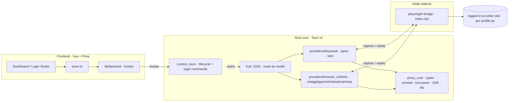
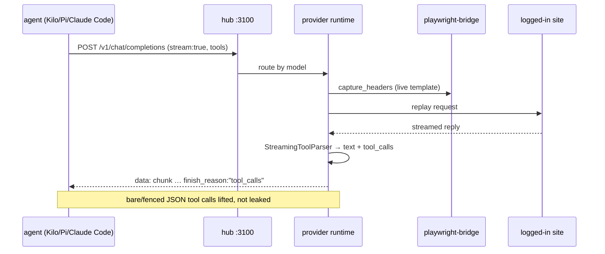
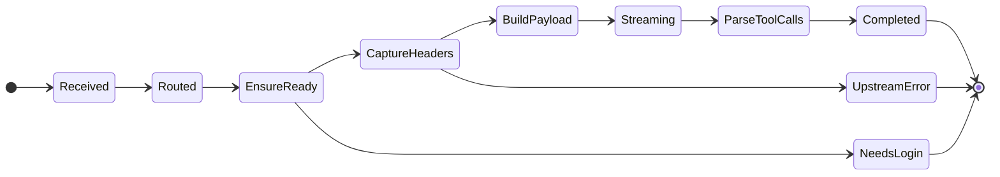
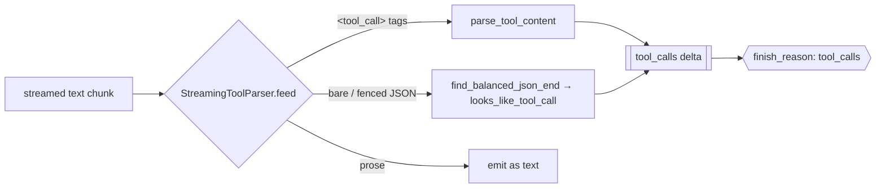
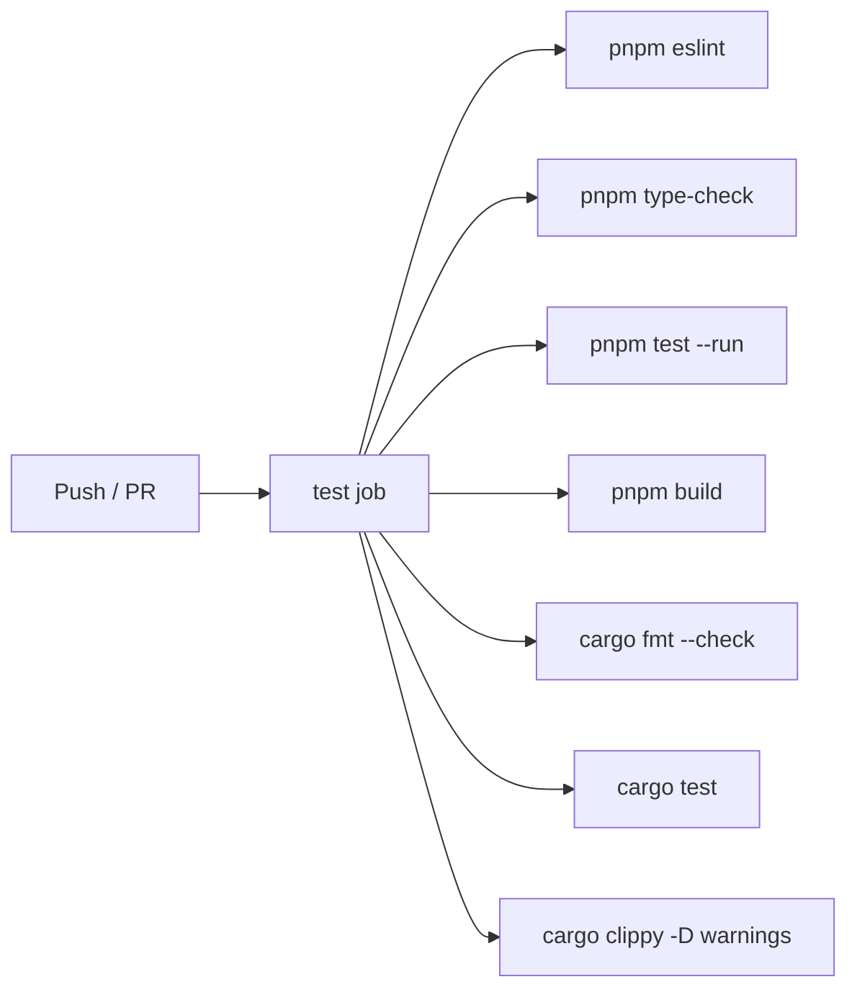
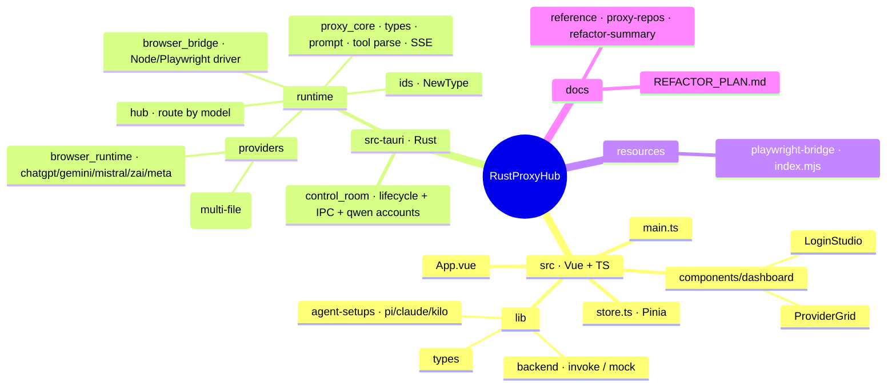

<div align="center">

<h1 align="center">
 RustProxyHub 
</h1>

A local-first, **keyless** LLM proxy cockpit. One desktop app turns your own logged-in browser sessions for eight AI providers into a single OpenAI- and Anthropic-compatible endpoint — point any coding agent at it: no API keys, no token billing, no cloud, your cookies never leave the machine. Built on Tauri v2 (Rust) + Vue 3.

<p align="center">
 
 
 
 
 
 
</p>

**English** · [Português (BR)](README.pt-BR.md)

</div>

---

<h1 align="center">
 
 Demo | Command Center
</h1>

```
 RustProxyHub v2.11.2                       hub: http://127.0.0.1:3100 · OpenAI + Anthropic

 ──────────────────────────────────────────────────────────────────────────
   Providers                                          ● logged in   ✕ logged out
 ──────────────────────────────────────────────────────────────────────────
  ● deepseek   ● qwen   ✕ kimi   ● chatgpt   ✕ gemini        [ Open session ]
 ──────────────────────────────────────────────────────────────────────────
   Models feed  (/v1/models · merged across providers)         8 providers · streaming ●
 ──────────────────────────────────────────────────────────────────────────
  deepseek-v4-pro            · deepseek   · thinking
  deepseek-v4-vision         · deepseek   · vision
  qwen-plus-2025-07-28       · qwen       · web-search
 ──────────────────────────────────────────────────────────────────────────
  [Runtime ▸ healthy]   tools: bare + fenced JSON parsed       Login Studio ▸ ready
 ──────────────────────────────────────────────────────────────────────────

 ▶ Point any OpenAI/Anthropic client at the hub — your logged-in sessions do the rest.
```

---

<h1 align="center">
  Supported Providers
</h1>

| Provider | Runtime | Port | Chat | Stream | Tools | Vision | Web search |
|---|---|---|:---:|:---:|:---:|:---:|:---:|
| **DeepSeek** | native | 3001 | ✓ | ✓ | ✓ | ✓ | ✓ |
| **Qwen** | native | 3000 | ✓ | ✓ | ✓ | ~¹ | ✓ |
| **Kimi** | native | 3002 | ✓ | ✓ | ✓ | ✗ | ✗ |
| **ChatGPT** | browser | 3003 | ✓ | ✓ | ✓ | ✗ | ✗ |
| **Gemini** | browser | 3004 | ✓ | ✓ | ✓ | ✗ | ✗ |
| **Mistral** | browser | 3005 | ✓ | ✓ | ✓ | ✗ | ✗ |
| **Z.ai** (GLM) | browser | 3006 | ✓ | ✓ | ✓ | ✗ | ✗ |
| **Meta AI** | browser | 3007 | ✓ | ✓ | ✓ | ✗ | ✗ |

<sup>**Tools** — best-effort: the proxy injects the tool schema into the prompt and parses calls back (`<tool_call>` tags **or** bare/fenced JSON), so accuracy tracks the underlying model. OpenAI `function` **and** `custom` tool types, plus `tool_choice` `auto`/`required`/`none`/named/`allowed_tools`. · **Vision**: ✓ = `deepseek-v4-vision`; ~¹ Qwen = image/file **upload** (`/v1/upload`) rather than a vision chat model. · **Web search**: server-verified (`qwen`, `deepseek`).</sup>

> The **hub** on `:3100` aggregates all of the above behind one OpenAI/Anthropic-compatible surface and routes each request to a provider by inferring it from the model name.

---

<h1 align="center">How It Works</h1>


---

<h1 align="center">
  Features
</h1>

* **One endpoint, eight providers**: the hub exposes a single OpenAI- **and** Anthropic-compatible surface (`/v1/chat/completions`, `/v1/messages`, `/v1/models`, `/v1/responses`) and routes by model name — your agent never knows there are eight backends
* **No API keys**: every provider is driven through a **real logged-in browser session**; the proxy captures the live request template and replays it — your subscription, no token billing
* **Live SSE streaming**: replies stream back as OpenAI `chat.completion.chunk` events with a terminating `finish_reason` — one shared framing layer for every provider
* **Tool calling that actually fires**: a single `StreamingToolParser` lifts tool calls whether the model emits `<tool_call>` tags **or** bare / ```-fenced JSON (single, multiple, or split across stream chunks) — so Kilo, Pi, and Claude Code get real `tool_calls`, not leaked text
* **DeepSeek Vision**: `deepseek-v4-vision` flips the chat into vision mode (chat-only upstream, reachable only through the browser session)
* **Qwen multi-account**: per-account logged-in sessions in a local SQLite store, masked in every API/IPC response
* **Agent-setup snippets**: one click generates ready-to-paste config for Pi (`models.json`), Claude Code (`settings.json`), and Kilo pointed at the hub
* **Login Studio**: open, watch, and close each provider's browser login from the dashboard; sessions persist under app-data
* **Cross-platform runtime detection**: finds any installed Chromium-family browser (Edge / Chrome / Chromium) and the right Node binary per platform
* **Local-first**: SQLite on disk, sessions under the OS app-data dir; nothing leaves the machine

---

<h1 align="center">
  Tech Stack
</h1>

<p align="center">
 
</p>

* **Shell / Runtime**: Tauri v2 (Rust core + system WebView), single desktop binary
* **Backend**: Rust 2021 · `tokio` async · `axum` HTTP · `reqwest` (rustls) upstream client · `rusqlite` (bundled SQLite) · `anyhow` errors · domain-id **newtypes**
* **Frontend**: Vue 3 · TypeScript · Vite · Pinia state · HugeIcons · a hand-rolled dark macOS-style design system (tokens in `src/assets/main.css`)
* **Browser bridge**: a bundled **Node + Playwright** helper (`resources/playwright-bridge/index.mjs`) the Rust side drives over JSON to automate the logged-in session; `node.exe` + Playwright runtime ship inside the bundle on Windows
* **Storage**: SQLite (Qwen accounts) under the app-data dir; provider sessions persist per profile
* **CI/CD**: GitHub Actions — ESLint · `vue-tsc` typecheck · Vitest · frontend build · `cargo fmt --check` · `cargo test` · `cargo clippy -D warnings`
* **Quality**: `rustfmt` · Clippy · ESLint · Prettier · Vitest
* **Packaging**: Windows NSIS `-setup.exe` + portable `tauri-app.exe` (bundles Node + the Playwright helper)

---

<h1 align="center">
 
 Installation & Setup
</h1>

```bash
git clone https://github.com/SobralCybersec/RustProxyHub.git
cd RustProxyHub
pnpm install
```

### Requirements

- **Rust** (stable) + Cargo
- **Node** 20+ and **pnpm**
- A **Chromium-family browser** — Microsoft Edge, Chrome, or Chromium (the bridge drives the `chromium` engine with an `msedge`/`chrome` channel)
- **Linux system deps** (Tauri v2 / WebKitGTK):
  ```bash
  # Debian/Ubuntu
  sudo apt-get install -y libwebkit2gtk-4.1-dev libgtk-3-dev \
    libayatana-appindicator3-dev librsvg2-dev
  ```
- A logged-in browser session per provider (done once from the **Login Studio**)

### Run (development)

```bash
# Full desktop app — Rust runtime + dashboard
pnpm tauri dev

# Frontend only (fast; in-browser mock backend, no Rust)
pnpm dev            # → vite on :1420
```

> Inside the Tauri window the dashboard calls the real Rust backend; opened as a plain browser tab (`vite`) it falls back to an in-memory mock so the UI still renders without a backend.

### Build (release)

```bash
# Debug packaging smoke-check (bundled runtime resources)
pnpm tauri build --debug

# Windows — NSIS -setup.exe + portable exe (bundles Node + Playwright)
pnpm release:windows
```

### Verify (the exact CI gates, locally)

```bash
pnpm verify
# = eslint · vue-tsc type-check · vitest · frontend build
#   · cargo audit · pnpm audit
#   · cargo test · cargo clippy --all-targets -D warnings
```

### Cargo Features

| Feature | Default | Effect |
|---|---|---|
| *(none)* | ✓ | There are no optional Cargo features. The Node + Playwright bridge is always bundled; the runtime detects the browser and Node at launch. |

> A former `standalone-provider-cli` feature (each provider as its own binary) was removed once the providers folded into the single Tauri runtime — every provider now runs in-process behind the hub.

---

<h1 align="center">
 
 Architecture
</h1>

RustProxyHub is a Tauri v2 app: a Vue dashboard calls typed Rust **IPC commands** to manage provider lifecycle and logins, while the same Rust process runs the whole proxy stack in-process. Each provider replays requests against a logged-in browser session driven by a Node + Playwright helper.



### Real-time streaming (SSE)

Every provider streams its reply back as OpenAI `chat.completion.chunk` events over `text/event-stream`. One shared framing layer (`proxy_core::sse_json` / `sse_done`) owns the wire shape, and a single `StreamingToolParser` reclassifies tool calls out of the text mid-stream so agents receive real `tool_calls`.



### API Surface

The hub speaks both wire formats; agents point at `http://127.0.0.1:3100`.

| Route | Purpose |
|---|---|
| `GET /v1/models` | Merged model list across every running provider |
| `POST /v1/chat/completions` | OpenAI chat (stream or non-stream, tools, vision) |
| `POST /v1/chat/completions/stop` | Cancel an in-flight stream |
| `POST /v1/responses` | OpenAI Responses-style entry |
| `POST /v1/messages` | Anthropic Messages (Claude Code) |
| `POST /v1/messages/count_tokens` | Anthropic token count |
| `GET /health` · `GET /providers` | Runtime + per-provider health |
| `POST /admin/manual_login` | (per provider) open the browser login session |

### Request lifecycle (state machine)

The dashboard never guesses status — it follows the runtime's health. A chat request walks a fixed path; a missing session short-circuits to a login prompt rather than a silent hang.



### Tool-call parsing — one shared path

Every provider (native and browser) routes its streamed text through the same `StreamingToolParser`. A model may emit a call three ways; all three land as OpenAI `tool_calls`, and anything that isn't a real call stays as text.



### Metrics

The Qwen runtime already exposes real telemetry — `GET /metrics` (Prometheus) and `/admin/status` (JSON), recorded on every request — so any number comes from *your* machine, not marketing:

| Metric | Type | Measures |
|---|---|---|
| `latency.request` | histogram | Request latency (ms), buckets 5 → 5000 |
| `requests.total` · `requests.errors` | counter | Request + error counts → error rate |
| `cache.hit` · `cache.miss` | counter | Model-list cache hit rate |
| `streams.active` | gauge | Live SSE streams |
| `memory.heap.used` | gauge | Process memory |

**Honest benchmarking** — two numbers, never blended into one hero figure:
- **Hub overhead** (the Rust code's real speed): request parse + route-by-model, measured against a *mock* provider with `oha`/`vegeta` — credibly **sub-millisecond to low single-digit ms**. This is the only place a "fast" claim is defensible.
- **End-to-end TTFT**: dominated by the **browser session** (seconds), not the proxy — a product characteristic measured with `llmperf`/AIPerf against the real endpoint, never a proxy-speed brag.
- **Not claimed**: throughput / req-s / tokens-s / "*N×* faster than *&lt;gateway&gt;*". A browser session is serial and provider-throttled, so those numbers would describe a mock, not reality.

> The `Metrics` system is currently wired into the Qwen provider; extending it hub-wide is a tracked follow-up.

---

<h1 align="center">
  GitHub Actions CI/CD
</h1>

### Workflow Matrix

| Job | Trigger | Steps |
|---|---|---|
| `test` | push (main) / PR | ESLint · `vue-tsc` typecheck · Vitest · frontend build · `cargo fmt --check` · `cargo test` · `cargo clippy --all-targets -D warnings` |



> One job, one contract: the frontend and Rust gates share a single green bar. `clippy -D warnings` keeps the default build warning-clean.

---

<h1 align="center">
  Project Structure
</h1>



---

<h1 align="center">
  Limitations & Notes
</h1>

### Out of Scope
- **No API-key providers shipped**: everything runs through a real logged-in browser session; there is no headless model or key-based fallback bundled
- **No cloud / no accounts**: everything is local-first; there is no RustProxyHub server
- **Vision is chat-only upstream**: `deepseek-v4-vision` reaches the web vision mode through the session; image *upload* through the bridge is a tracked follow-up
- **Windows-first packaging**: the release artifacts are the NSIS `-setup.exe` + portable exe (Node + Playwright bundled); Linux/macOS run from `pnpm tauri dev`

### Notes & Guarantees
- **Cookies never leave the machine** — per-profile browser session under the app-data dir
- **Login before use** — a dropped session returns a clear login prompt instead of a silent stall (open it from the Login Studio)
- **Tool calls are wire-correct** — bare/fenced JSON is reclassified into `tool_calls` with a terminating `finish_reason:"tool_calls"` (Kilo users: set the provider `toolFormat: native`)
- **Default build stays green** — CI runs `clippy -D warnings` on every push
- **Passwords are local** — Qwen account passwords live in the app-data SQLite, never serialized into IPC/API responses

### Disclaimer

RustProxyHub automates **your own** logged-in sessions. It is **not affiliated with, associated with, or endorsed by** any of the providers it connects to. Automating these web sessions may violate a provider's terms of service and can rate-limit or suspend your account — you use **your own accounts, at your own risk**. Provided for personal and educational use, as-is, with no warranty.

---

<h1 align="center"> References</h1>

> Core frameworks, the browser-automation stack, and the 2026 proxy / tool-calling research that shaped the runtime. Third-party projects belong to their authors.

<h2 align="center">

**Tauri v2**: [tauri.app](https://v2.tauri.app/) 

</h2>

<h2 align="center">

**Vue**: [vuejs.org](https://vuejs.org/) · **Vite**: [vite.dev](https://vite.dev/) · **Pinia**: [pinia.vuejs.org](https://pinia.vuejs.org/) 

</h2>

<h2 align="center">

**axum**: [github.com/tokio-rs/axum](https://github.com/tokio-rs/axum) · **tokio**: [tokio.rs](https://tokio.rs/) 

</h2>

<h2 align="center">

**rusqlite / SQLite**: [github.com/rusqlite/rusqlite](https://github.com/rusqlite/rusqlite) · [sqlite.org](https://www.sqlite.org/) 

</h2>

<h2 align="center">

**Playwright**: [playwright.dev](https://playwright.dev/) 

</h2>

<h2 align="center">

**OpenAI streaming tool calls (2026)**: [platform / streaming events reference](https://developers.openai.com/api/reference/resources/chat/subresources/completions/streaming-events) 

</h2>

<h2 align="center">

**Kilo Code tool protocol**: [Kilo-Org/kilocode](https://github.com/Kilo-Org/kilocode) · **Roo native tool calling**: [RooCodeInc/Roo-Code](https://github.com/RooCodeInc/Roo-Code) 

</h2>

<h2 align="center">

**DeepSeek-V4 Vision (2026)**: [whale can now see — SCMP](https://www.scmp.com/tech/tech-trends/article/3351892/whale-can-now-see-deepseek-adds-ai-vision-major-move) 

</h2>

<h2 align="center">

**AI-gateway prior art (Rust, 2026)**: [api7/aisix](https://github.com/api7/aisix) · [llm-proxy topic](https://github.com/topics/llm-proxy?l=rust) 

</h2>
