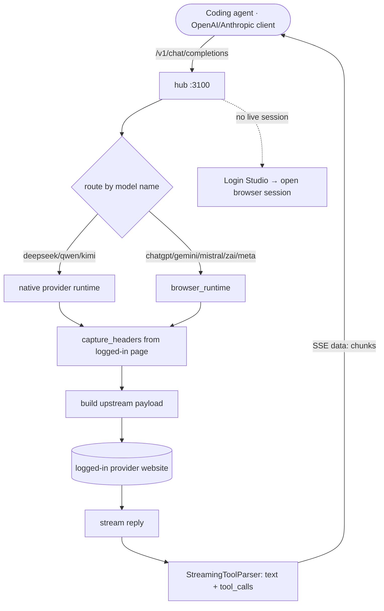
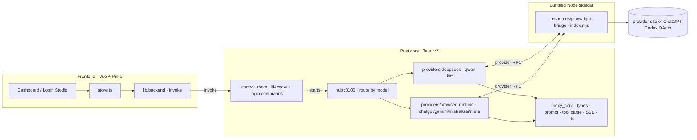
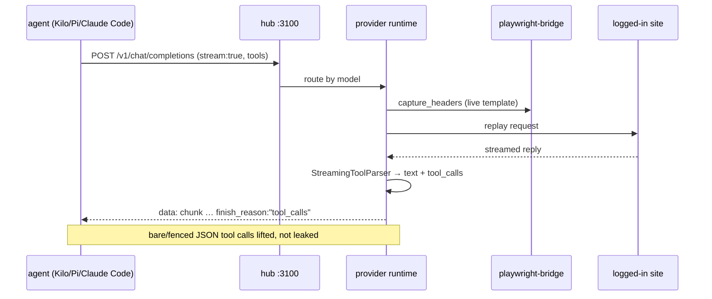
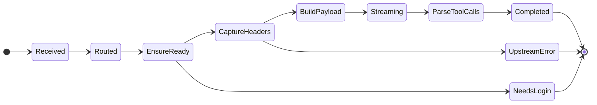
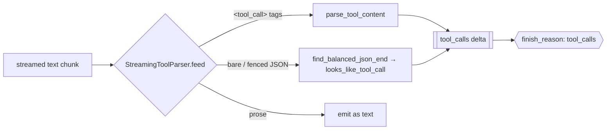
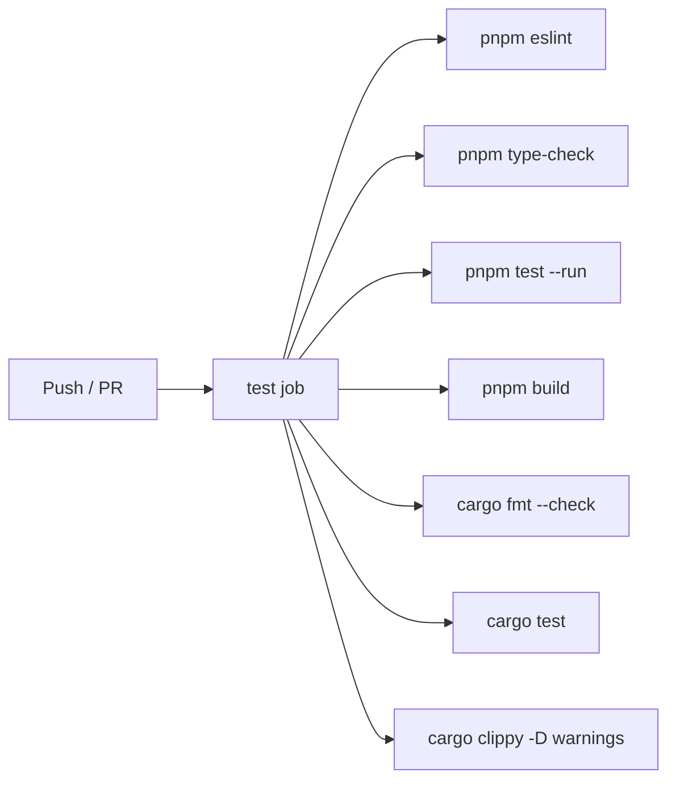
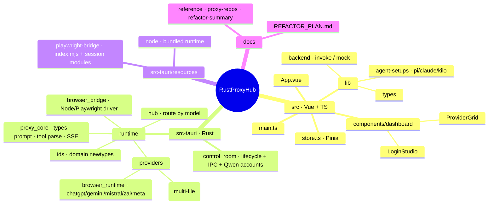

<div align="center">

<h1 align="center">
 RustProxyHub 
</h1>

A local-first, **keyless** LLM proxy cockpit. One desktop app turns your own logged-in browser sessions for eight AI providers into a single OpenAI- and Anthropic-compatible endpoint — point any coding agent at it: no provider API keys required for browser-backed sessions, no RustProxyHub cloud relay, and local session state. Built on Tauri v2 (Rust) + Vue 3.

<p align="center">
 
 
 
 
 
 
</p>

**English** · [Português (BR)](README.pt-BR.md)

</div>

---

<h1 align="center">
 
 Demo | Command Center
</h1>

```
 RustProxyHub v2.11.2                       hub: http://127.0.0.1:3100 · OpenAI + Anthropic

 ──────────────────────────────────────────────────────────────────────────
   Providers                                          ● logged in   ✕ logged out
 ──────────────────────────────────────────────────────────────────────────
  ● deepseek   ● qwen   ✕ kimi   ● chatgpt   ✕ gemini        [ Open session ]
 ──────────────────────────────────────────────────────────────────────────
   Models feed  (/v1/models · merged across providers)         8 providers · streaming ●
 ──────────────────────────────────────────────────────────────────────────
  deepseek-v4-pro            · deepseek   · thinking
  deepseek-v4-vision         · deepseek   · vision
  qwen-plus-2025-07-28       · qwen       · web-search
 ──────────────────────────────────────────────────────────────────────────
  [Runtime ▸ healthy]   tools: bare + fenced JSON parsed       Login Studio ▸ ready
 ──────────────────────────────────────────────────────────────────────────

 ▶ Point any OpenAI/Anthropic client at the hub — your logged-in sessions do the rest.
```

---

<h1 align="center">
  Supported Providers
</h1>

| Provider | Runtime | Port | Chat | Stream | Tools | Vision | Web search |
|---|---|---|:---:|:---:|:---:|:---:|:---:|
| **DeepSeek** | native | 3001 | ✓ | ✓ | ✓ | ✓ | ✓ |
| **Qwen** | native | 3000 | ✓ | ✓ | ✓ | ~¹ | ✓ |
| **Kimi** | native | 3002 | ✓ | ✓ | ✓ | ✗ | ✗ |
| **ChatGPT** | OAuth + Codex | 3003 | ✓ | ✓ | ✓ | ✗ | ✗ |
| **Gemini** | browser | 3004 | ✓ | ✓ | ✓ | ✗ | ✗ |
| **Mistral** | browser | 3005 | ✓ | ✓ | ✓ | ✗ | ✗ |
| **Z.ai** (GLM) | browser | 3006 | ✓ | ✓ | ✓ | ✗ | ✗ |
| **Meta AI** | browser | 3007 | ✓ | ✓ | ✓ | ✗ | ✗ |

<sup>**Tools** — best-effort: the proxy injects the tool schema into the prompt and parses calls back (`<tool_call>` tags **or** bare/fenced JSON), so accuracy tracks the underlying model. OpenAI `function` **and** `custom` tool types, plus `tool_choice` `auto`/`required`/`none`/named/`allowed_tools`. · **Vision**: ✓ = `deepseek-v4-vision`; ~¹ Qwen = image/file **upload** (`/v1/upload`) rather than a vision chat model. · **Web search**: server-verified (`qwen`, `deepseek`).</sup>

> The **hub** on `:3100` aggregates all of the above behind one OpenAI/Anthropic-compatible surface and routes each request to a provider by inferring it from the model name.

---

<h1 align="center">How It Works</h1>



---

<h1 align="center">
  Features
</h1>

* **One endpoint, eight providers**: the hub exposes a single OpenAI- **and** Anthropic-compatible surface (`/v1/chat/completions`, `/v1/messages`, `/v1/models`, `/v1/responses`) and routes by model name — your agent never knows there are eight backends
* **No provider API keys**: browser-backed providers use a **real logged-in browser session**; the proxy captures the live request template and replays it. The local hub can still enable `RUST_PROXY_HUB_API_KEY` for client authentication
* **Live SSE streaming**: replies stream back as OpenAI `chat.completion.chunk` events with a terminating `finish_reason` — one shared framing layer for every provider
* **Tool calling that actually fires**: a single `StreamingToolParser` lifts tool calls whether the model emits `<tool_call>` tags **or** bare / ```-fenced JSON (single, multiple, or split across stream chunks) — so Kilo, Pi, and Claude Code get real `tool_calls`, not leaked text
* **DeepSeek Vision**: `deepseek-v4-vision` flips the chat into vision mode (chat-only upstream, reachable only through the browser session)
* **Qwen multi-account**: per-account logged-in sessions in a local SQLite store, with account passwords omitted from serialized API/IPC responses
* **Agent-setup snippets**: one click generates ready-to-paste config for Pi (`models.json`), Claude Code (`settings.json`), and Kilo pointed at the hub
* **Login Studio**: open, watch, and close each provider's browser login from the dashboard; sessions persist under app-data
* **Cross-platform runtime detection**: finds any installed Chromium-family browser (Edge / Chrome / Chromium) and the right Node binary per platform
* **Local-first**: SQLite and session state stay under the OS app-data directory; there is no RustProxyHub server or cloud relay

---

<h1 align="center">
  What It Saves You
</h1>

RustProxyHub removes repeated gateway, provider, and agent setup work. These are workflow savings visible in the code and UI, not fabricated end-to-end speed claims.

| Work normally repeated | RustProxyHub path | What it saves |
|---|---|---|
| Configure each coding client for each provider | One hub at `127.0.0.1:3100` with OpenAI + Anthropic routes | Duplicate base URLs, adapters, and provider switches |
| Maintain separate provider integrations | `route by model name` in one Rust hub | Repeated client-side routing logic |
| Reimplement streaming tool-call handling | One `StreamingToolParser` plus shared SSE framing | Parser drift across eight provider paths |
| Re-enter browser credentials for each request | Login Studio + persistent local provider sessions | Repeated login and header setup |
| Diagnose a failed provider run | `/health`, `/providers`, provider logs, Qwen `/metrics`, `/admin/status` | Blind retries and manual log collection |
| Prepare agent configuration | Dashboard snippets for Pi, Claude Code, and Kilo | Copying provider-specific config by hand |
| Host a separate gateway | Tauri desktop app + embedded Rust services | Cloud hosting, deployment, and gateway maintenance |

### Benefits for a CV / portfolio

This project is useful as a CV project because one repository shows product thinking and implementation depth in the same artifact:

- **Systems design**: eight provider runtimes converge on one OpenAI/Anthropic-compatible contract.
- **Backend engineering**: Rust, Tokio, Axum, request routing, health checks, SSE, cancellation, and bounded upstream errors.
- **Frontend engineering**: Vue 3 + Pinia control room with provider health, login lifecycle, model discovery, logs, and workbench flows.
- **Integration engineering**: Rust drives a bundled Node + Playwright bridge and normalizes browser-backed provider sessions.
- **Reliability**: Qwen stream registry uses an `ActiveStreamGuard`; cache, watchdog, health, and provider logs expose runtime state.
- **Security awareness**: loopback defaults, optional hub authentication, masked account responses, local app-data storage, and explicit SSRF/secret-handling tests.
- **Delivery discipline**: CI covers lint, typecheck, Vitest, Node bridge tests, Vite build, Rust formatting, Rust tests, and Clippy.

**CV-ready summary:** *Built a local-first Rust/Tauri LLM gateway that routes eight browser-backed providers through OpenAI and Anthropic-compatible APIs, with SSE tool-call parsing, Vue/Pinia observability UI, Playwright integration, local account/session management, and CI security gates.*

---

<h1 align="center">
  Tech Stack
</h1>

<p align="center">
 
</p>

* **Shell / Runtime**: Tauri v2 (Rust core + system WebView), single desktop binary
* **Shell / Runtime**: Tauri v2 (Rust core + system WebView), one desktop binary
* **Backend**: Rust 2021 · `tokio` async · `axum` 0.8 · `reqwest` 0.12 with rustls · `rusqlite` 0.31 bundled SQLite · `serde` · `anyhow`
* **Frontend**: Vue 3.5 · TypeScript 6 · Vite 8 · Pinia 3 · HugeIcons · dark control-room design tokens in `src/assets/main.css`
* **Browser bridge**: bundled Node + Playwright 1.60 helper (`src-tauri/resources/playwright-bridge/index.mjs`) driven by Rust; bundled `node.exe` and Playwright resources are prepared before Tauri packaging
* **Storage**: Qwen accounts in local SQLite; provider runtime/session data under the Tauri app-data directory
* **CI/CD**: GitHub Actions — ESLint · `vue-tsc` typecheck · Vitest · Node bridge tests · frontend build · `cargo fmt --check` · `cargo test` · `cargo clippy -D warnings`
* **Quality**: `rustfmt` · Clippy · ESLint · Prettier · Vitest · CodeQL · Gitleaks · cargo-audit
* **Packaging**: Tauri release matrix for Linux `.deb`/AppImage and Windows NSIS/portable outputs; bundled Node + Playwright runtime

---

<h1 align="center">
 
 Installation & Setup
</h1>

```bash
git clone https://github.com/SobralCybersec/RustProxyHub.git
cd RustProxyHub
pnpm install
```

### Requirements

- **Rust** (stable) + Cargo
- **Node** 20+ and **pnpm**
- A **Chromium-family browser** — Microsoft Edge, Chrome, or Chromium (the bridge drives the `chromium` engine with an `msedge`/`chrome` channel)
- **Linux system deps** (Tauri v2 / WebKitGTK):
  ```bash
  # Debian/Ubuntu
  sudo apt-get install -y libwebkit2gtk-4.1-dev libgtk-3-dev \
    libayatana-appindicator3-dev librsvg2-dev
  ```
- A logged-in browser session per provider (done once from the **Login Studio**)

### Run (development)

```bash
# Full desktop app — Rust runtime + dashboard
pnpm tauri dev

# Frontend only (fast; in-browser mock backend, no Rust)
pnpm dev            # → vite on :1420
```

> Inside the Tauri window the dashboard calls the real Rust backend; opened as a plain browser tab (`vite`) it falls back to an in-memory mock so the UI still renders without a backend.

### Build (release)

```bash
# Debug packaging smoke-check (bundled runtime resources)
pnpm tauri build --debug

# Windows — NSIS -setup.exe + portable exe (bundles Node + Playwright)
pnpm release:windows
```

### Verify (the exact CI gates, locally)

```bash
pnpm verify
# = eslint · vue-tsc type-check · vitest · Node bridge tests · frontend build
#   · cargo audit · pnpm audit
#   · cargo test · cargo clippy --all-targets -D warnings
```

### Cargo Features

| Feature | Default | Effect |
|---|---|---|
| *(none)* | ✓ | There are no optional Cargo features. The Node + Playwright bridge is always bundled; the runtime detects the browser and Node at launch. |

> A former `standalone-provider-cli` feature (each provider as its own binary) was removed once the providers folded into the single Tauri runtime — every provider now runs in-process behind the hub.

---

<h1 align="center">
 
 Architecture
</h1>

RustProxyHub is a Tauri v2 app: a Vue dashboard calls typed Rust **IPC commands** to manage provider lifecycle and logins, while the same Rust process runs the whole proxy stack in-process. Browser-backed providers replay requests through a Node + Playwright helper. ChatGPT supports browser web sessions plus OAuth credentials for the Codex `/responses` upstream.



### Real-time streaming (SSE)

Every provider streams its reply back as OpenAI `chat.completion.chunk` events over `text/event-stream`. One shared framing layer (`proxy_core::sse_json` / `sse_done`) owns the wire shape, and a single `StreamingToolParser` reclassifies tool calls out of the text mid-stream so agents receive real `tool_calls`. ChatGPT requests use stateless Codex `/responses` payloads with system instructions kept in the trusted `instructions`/developer channel instead of folded into user text.



### API Surface

The hub speaks both wire formats; agents point at `http://127.0.0.1:3100`.

| Route | Purpose |
|---|---|
| `GET /v1/models` | Merged model list across every running provider |
| `POST /v1/chat/completions` | OpenAI chat (stream or non-stream, tools, vision) |
| `POST /v1/chat/completions/stop` | Cancel an in-flight stream |
| `POST /v1/responses` | OpenAI Responses-style entry |
| `POST /v1/messages` | Anthropic Messages (Claude Code) |
| `POST /v1/messages/count_tokens` | Anthropic token count |
| `GET /health` · `GET /providers` | Runtime + per-provider health |
| `POST /admin/manual_login` | (per provider) open the browser login session |

### Provider tool-call smoke

Start the desktop runtime (`pnpm tauri dev`), then start Hub and the providers to exercise in Login Studio. With that runtime running, this sends one streamed OpenAI function-call request to every model returned by `GET /v1/models`, then prints provider/model/SSE result metadata and provider bridge logs as JSON. Set `RUST_PROXY_HUB_API_KEY` when hub auth is enabled.

```bash
pnpm smoke:provider-tools
# or: pnpm smoke:provider-tools -- --hub http://127.0.0.1:3100 --api-key "$RUST_PROXY_HUB_API_KEY"
```

`tests/node/provider-tool-smoke.test.mjs` creates an isolated HTTP hub on an ephemeral port, injects temporary `RUST_PROXY_HUB_URL` / `RUST_PROXY_HUB_API_KEY` values into this CLI, and removes the server after the run. It covers all eight provider routes (`chatgpt`, `deepseek`, `gemini`, `kimi`, `meta`, `mistral`, `qwen`, `zai`) and asserts request auth, forced function schema, streamed `tool_calls`, terminal `[DONE]`, and one provider log per route. The live smoke is intentionally separate: it verifies real logged-in sessions and reports their bridge logs without persisting secrets or test artifacts.

For external coding CLIs, point their documented OpenAI-compatible base URL at `http://127.0.0.1:3100/v1`; point Anthropic-compatible clients at `http://127.0.0.1:3100` so `/v1/messages` remains reachable. Run the smoke command after configuring a client to verify both wire response and provider-side log output.

### Coding-client prompt interaction smoke

```bash
pnpm smoke:client-interactions
# one client only
pnpm smoke:client-interactions -- --client claude
```

This creates a tool-result follow-up for every discovered provider model. It verifies a system prompt, user prompt, assistant tool call, tool result, terminal stream event, and `RUST_PROXY_HUB_INTERACTION_CONFIRMED` response. Kilo, Pi, and OpenCode share the OpenAI Chat Completions check; Claude uses the Anthropic Messages check. The JSON report includes a ready-to-fill configuration shape for every client.

Use a model returned by `GET /v1/models`, including its provider prefix (for example `qwen:qwen3`):

These fields follow current [Kilo](https://kilo.ai/docs/ai-providers/openai-compatible), [Claude Code gateway](https://docs.anthropic.com/en/docs/claude-code/llm-gateway), [Pi](https://github.com/badlogic/pi-mono/blob/main/packages/coding-agent/docs/models.md), and [OpenCode](https://opencode.ai/docs/providers) documentation.

| Client | Hub wiring |
|---|---|
| Kilo Code | Add an **OpenAI Compatible** provider in its provider UI. Set Base URL to `http://127.0.0.1:3100/v1`, API key from `RUST_PROXY_HUB_API_KEY`, then select a discovered model. |
| Claude Code | `export ANTHROPIC_BASE_URL=http://127.0.0.1:3100` and `export ANTHROPIC_AUTH_TOKEN="$RUST_PROXY_HUB_API_KEY"`; select a hub model supported by the client. |
| Pi | Add `rust_proxy_hub` to `~/.pi/agent/models.json` with `baseUrl: "http://127.0.0.1:3100/v1"`, `api: "openai-completions"`, `apiKey: "RUST_PROXY_HUB_API_KEY"`, `authHeader: true`, and the selected model. |
| OpenCode | Add an `@ai-sdk/openai-compatible` provider in `opencode.json` with `options.baseURL: "http://127.0.0.1:3100/v1"`, `options.apiKey: "{env:RUST_PROXY_HUB_API_KEY}"`, and the selected model. |

The temporary test server used by `tests/node/provider-tool-smoke.test.mjs` executes this CLI with isolated URL/key values, asserts both OpenAI and Anthropic request shapes, and closes after the test.

### Tool-path benchmarks

```bash
pnpm benchmark:provider-tools          # Node SSE parse + tool-call assembly
pnpm benchmark:rust-tools              # release Rust StreamingToolParser
pnpm benchmark:provider-interactions   # saved-session hub + up to 8 models/provider + history
pnpm benchmark:provider-interactions -- --max-models-per-provider 0  # all fetched models
BENCH_ITERATIONS=50000 pnpm benchmark:provider-tools
```

Both commands warm up first and emit JSON with elapsed milliseconds, iterations, operations/second, and detected tool calls. They measure parser overhead only—not provider latency, browser automation, or model throughput—so results stay comparable across local changes without implying an end-to-end performance claim.

`benchmark:provider-interactions` uses the running Hub and its saved provider sessions, fetches `GET /v1/models`, then runs one deterministic tool call and two prompt → tool-result interactions (OpenAI and Anthropic). It schedules up to eight models per provider by default; pass `--max-models-per-provider 0` to run every fetched model. It appends full response/log observations to `benchmark-history/provider-model-history.jsonl` and regenerates `benchmark-history/provider-model-history.md` with every run plus latest output previews. Each run ends with total elapsed time; fetched, scheduled, and worked model/provider counts; and fetched-log and log-entry counts. Use `--iterations N` only when keeping Hub, model set, prompt contract, and client configuration fixed; observed latency includes provider/browser time and is not a throughput comparison. The append-only JSONL source and generated Markdown index follow [JSON Lines](https://jsonlines.org/) and the fixed-harness comparison guidance in [OpenAI's evaluation playbook](https://openai.com/index/trustworthy-third-party-evaluations-foundations/).

### Request lifecycle (state machine)

The dashboard never guesses status — it follows the runtime's health. A chat request walks a fixed path; a missing session short-circuits to a login prompt rather than a silent hang.



### Tool-call parsing — one shared path

Every provider (native and browser) routes its streamed text through the same `StreamingToolParser`. A model may emit a call three ways; all three land as OpenAI `tool_calls`, and anything that isn't a real call stays as text.



### Metrics

The Qwen runtime exposes local telemetry at `GET /metrics` (Prometheus text) and `GET /admin/status` (JSON). The hub exposes runtime health at `GET /health`, provider health at `GET /providers`, and provider logs at `GET /providers/{provider}/logs`.

| Metric family | Type | Measures |
|---|---|---|
| `requests.total` · `requests.errors` | counters | Qwen request volume and errors |
| `streams.active` · `streams.errors` | gauge/counter | Active SSE streams and stream failures |
| `cache.*` | counters/histograms | Cache operations, hits, misses, value size, and lookup latency |
| `watchdog.*` | gauges/counters | RAM/overall status and recovery attempts |
| `memory.heap.*` | gauges | Memory used and total memory |
| `latency.request` | histogram | Request latency with 5–5000 ms buckets |

The source registers **19 Qwen metric definitions**. Use `/metrics` or `/admin/status` from the running instance for actual values; the README makes no proxy-speed or end-to-end TTFT claim because provider/browser latency dominates.

---

<h1 align="center">
  GitHub Actions CI/CD
</h1>

### Workflow Matrix

| Job | Trigger | Steps |
|---|---|---|
| `test` | push (main) / PR | ESLint · `vue-tsc` typecheck · Vitest · frontend build · `cargo fmt --check` · `cargo test` · `cargo clippy --all-targets -D warnings` |



> One job, one contract: the frontend and Rust gates share a single green bar. `clippy -D warnings` keeps the default build warning-clean.

---

<h1 align="center">
  Project Structure
</h1>



---

<h1 align="center">
  IT-Management Objectives → Metrics
</h1>

> I built this project to demonstrate classic IT-management objectives **in practice**. Every objective below points to a verifiable artifact — a file, a CI gate, a test count, an architecture decision — never a showcase number. True to the `Metrics` section: if you can't open the code and check it, it isn't here.

| # | Objective | How RustProxyHub delivers it | Verifiable metric |
|---|---|---|---|
| 1 | **Look at the business** | One endpoint speaking both OpenAI **and** Anthropic consolidates eight providers; the business goal is simpler agent access and less gateway duplication | 8 providers → 1 endpoint · 2 API dialects |
| 2 | **Measure the area's performance** | Qwen exposes Prometheus `/metrics` and JSON `/admin/status`; the hub exposes `/health` and `/providers` | 19 registered Qwen metric definitions |
| 3 | **Allocate costs** | Request, error, cache, stream, and watchdog counters provide a local basis for provider/account usage review | `requests.total` · `requests.errors` · `cache.*` |
| 4 | **Maintain internal service levels** | Dashboard health polling, provider readiness checks, login state, last errors, and explicit degraded status avoid silent failure | `/health` + `/providers` + dashboard status cards |
| 5 | **Reduce cost** | Browser-backed sessions avoid mandatory provider API-key and separate gateway hosting costs; provider subscription terms still apply | 1 local hub · 0 RustProxyHub cloud services |
| 6 | **Optimize structure** | Shared routing, SSE framing, tool parsing, session storage, and provider lifecycle reduce duplicated integration code | 1 hub route owner · 1 shared tool parser |
| 7 | **Be agile** | Small provider modules share a stable hub contract and a local workbench, so a provider can be exercised without changing every client | 8 provider adapters behind one contract |
| 8 | **Innovate in proposed solutions** | A real logged-in browser session becomes the provider integration boundary instead of a mandatory API-key connector | Browser bridge + local Login Studio |
| 9 | **Make accurate forecasts** | Request-latency histogram, active-stream gauges, cache counters, watchdog state, and weekly build-cost workflow provide measurable inputs | 5–5000 ms latency buckets · weekly build-cost report |
| 10 | **Don't focus on "commodities"** | Mature crates handle HTTP, async execution, JSON, and SQLite; project code concentrates on routing, normalization, browser integration, and agent compatibility | `axum` · `tokio` · `reqwest` · `rusqlite` reused |
| 11 | **Generate correct information** | Domain ID newtypes, typed DTOs, masked account summaries, bounded error payloads, and routing tests protect information quality | 4 domain ID newtypes · typed health/model DTOs |
| 12 | **Maintain Business Intelligence** | Prometheus text, JSON admin status, provider logs, dashboard charts, and append-only benchmark history expose operational evidence | `/metrics` · `/admin/status` · `benchmark-history/` |
| 13 | **Focus on value actions** | Tests target routing, tool parsing, OAuth/web sessions, prompt compaction, account storage, stream cleanup, provider smoke paths, and UI workflows | 197 Rust test attrs · 33 Node tests · 20 Vitest tests |
| 14 | **Keep critical processes running** | RAII guard (`ActiveStreamGuard`) frees the stream-registry slot when a client disconnects before normal cleanup | Dedicated guard-drop tests |
| 15 | **Keep the environment secure** | Loopback defaults, optional hub auth, provider-key forwarding only to local services, masked account responses, SSRF guards, and secret scans reduce exposure | Gitleaks + CodeQL + cargo-audit workflows |
| 16 | **Keep infrastructure 24×7×365** | The critical path is local and does not depend on a RustProxyHub server; health checks and watchdog state make degradation visible | 0 RustProxyHub cloud dependencies |
| 17 | **Reusable model** | One `StreamingToolParser`, shared SSE helpers, typed IDs, and common provider lifecycle commands serve multiple runtimes | 1 parser shared across native/browser providers |
| 18 | **Win over the business people** | Bilingual UI/README, one-click agent setup snippets, dashboard status, and a quick-start translate technical capability into user workflow | English + Português · Pi/Claude/Kilo snippets |
| 19 | **Be more efficient, more effective** | CI combines frontend and Rust checks; release and performance workflows keep build and artifact cost visible | 8 CI gates · weekly build-cost workflow |
| 20 | **Standardize processes** | Pinned GitHub Actions, one `pnpm verify` contract, shared provider routes, and consistent health/log endpoints standardize delivery | 7 workflows · one local verification command |
| 21 | **Automate user tasks** | Login Studio, model discovery, provider routing, agent snippets, browser detection, session startup, and stream cancellation remove repetitive manual steps | 8 provider sessions managed from one dashboard |

---

<h1 align="center">
  Limitations & Notes
</h1>

### Out of Scope
- **No provider API-key fallback bundled**: browser-backed providers require a real logged-in session; the hub's optional local API key protects client access, not upstream billing
- **No cloud / no hosted control plane**: everything is local-first; there is no RustProxyHub server
- **Vision is chat-only upstream**: `deepseek-v4-vision` reaches the web vision mode through the session; image *upload* through the bridge is a tracked follow-up
- **Packaging matrix**: tagged releases build Linux `.deb`/AppImage and Windows NSIS/portable outputs; Linux/macOS can run from `pnpm tauri dev`

### Notes & Guarantees
- **Session state is local** — provider runtime data lives under the app-data dir; browser requests still go to the provider websites they target
- **Login before use** — a dropped session returns a clear login prompt instead of a silent stall (open it from the Login Studio)
- **Tool calls are wire-correct** — bare/fenced JSON is reclassified into `tool_calls` with a terminating `finish_reason:"tool_calls"` (Kilo users: set the provider `toolFormat: native`)
- **Default build stays green** — CI runs `clippy -D warnings` on every push
- **Passwords are local and masked** — Qwen account passwords live in app-data SQLite and are omitted from IPC/API responses; at-rest encryption remains a follow-up

### Disclaimer

RustProxyHub automates **your own** logged-in sessions. It is **not affiliated with, associated with, or endorsed by** any of the providers it connects to. Automating these web sessions may violate a provider's terms of service and can rate-limit or suspend your account — you use **your own accounts, at your own risk**. Provided for personal and educational use, as-is, with no warranty.

---

<h1 align="center"> References</h1>

> Core frameworks, the browser-automation stack, and the 2026 proxy / tool-calling research that shaped the runtime. Third-party projects belong to their authors.

<h2 align="center">

**Tauri v2**: [tauri.app](https://v2.tauri.app/) 

</h2>

<h2 align="center">

**Vue**: [vuejs.org](https://vuejs.org/) · **Vite**: [vite.dev](https://vite.dev/) · **Pinia**: [pinia.vuejs.org](https://pinia.vuejs.org/) 

</h2>

<h2 align="center">

**axum**: [github.com/tokio-rs/axum](https://github.com/tokio-rs/axum) · **tokio**: [tokio.rs](https://tokio.rs/) 

</h2>

<h2 align="center">

**rusqlite / SQLite**: [github.com/rusqlite/rusqlite](https://github.com/rusqlite/rusqlite) · [sqlite.org](https://www.sqlite.org/) 

</h2>

<h2 align="center">

**Playwright**: [playwright.dev](https://playwright.dev/) 

</h2>

<h2 align="center">

**OpenAI streaming tool calls (2026)**: [platform / streaming events reference](https://developers.openai.com/api/reference/resources/chat/subresources/completions/streaming-events) 

</h2>

<h2 align="center">

**Kilo Code tool protocol**: [Kilo-Org/kilocode](https://github.com/Kilo-Org/kilocode) · **Roo native tool calling**: [RooCodeInc/Roo-Code](https://github.com/RooCodeInc/Roo-Code) 

</h2>

<h2 align="center">

**DeepSeek-V4 Vision (2026)**: [whale can now see — SCMP](https://www.scmp.com/tech/tech-trends/article/3351892/whale-can-now-see-deepseek-adds-ai-vision-major-move) 

</h2>

<h2 align="center">

**AI-gateway prior art (Rust, 2026)**: [api7/aisix](https://github.com/api7/aisix) · [llm-proxy topic](https://github.com/topics/llm-proxy?l=rust) 

</h2>

---

## Research & documentation index

Local notes: [proxy / gateway repos](docs/reference/proxy-repos-2026.md) · [refactor summary](docs/reference/refactor-summary.md) · [token-saving and browser backends](docs/reference/token-saving-and-browser-backends.md).

Research clones in [`research/repos`](research/repos): [AI-Worker-Proxy](https://github.com/zxcloli666/AI-Worker-Proxy) · [CatGPT-Gateway](https://github.com/GautamVhavle/CatGPT-Gateway) · [code-context-engine](https://github.com/elara-labs/code-context-engine) · [copium](https://github.com/iKislay/copium) · [deepsproxy](https://github.com/pedrofariasx/deepsproxy) · [inferock-bench](https://github.com/inferock/inferock-bench) · [kimiproxy](https://github.com/pedrofariasx/kimiproxy) · [kiro2cc-proxy](https://github.com/TsinHzl/kiro2cc-proxy) · [lean-ctx](https://github.com/yvgude/lean-ctx) · [lowfat](https://github.com/zdk/lowfat) · [mimo-code-proxy](https://github.com/pedrofariasx/mimo-code-proxy) · [ollieproxy](https://github.com/pedrofariasx/ollieproxy) · [Patchright](https://github.com/Kaliiiiiiiiii-Vinyzu/patchright) · [Playwright](https://github.com/microsoft/playwright) · [qwenproxy](https://github.com/pedrofariasx/qwenproxy) · [sqz](https://github.com/ojuschugh1/sqz) · [token-savior](https://github.com/Mibayy/token-savior) · [tokensave](https://github.com/Prathamg042004/tokensave) · [tokless](https://github.com/HoangP8/tokless) · [zap](https://github.com/bitan-del/zap).

Design references: [api7/aisix](https://github.com/api7/aisix) · [x5iu/llm-proxy](https://github.com/x5iu/llm-proxy) · [KochC/opencode-llm-proxy](https://github.com/KochC/opencode-llm-proxy) · [ParzivalHack/Aegis.rs](https://github.com/ParzivalHack/Aegis.rs) · [Rust LLM-proxy topic](https://github.com/topics/llm-proxy?l=rust&o=asc&s=updated) · [Cliffle typestate](https://cliffle.com/blog/rust-typestate/) · [Comprehensive Rust typestate](https://google.github.io/comprehensive-rust/idiomatic/leveraging-the-type-system/typestate-pattern/typestate-example.html) · [Microsoft Rust newtype / typestate](https://microsoft.github.io/RustTraining/rust-patterns-book/ch03-the-newtype-and-type-state-patterns.html) · [Software Patterns Lexicon typestate](https://softwarepatternslexicon.com/rust/idiomatic-rust-patterns/the-typestate-pattern/) · [Software Patterns Lexicon newtype](https://softwarepatternslexicon.com/rust/idiomatic-rust-patterns/the-newtype-pattern/) · [typestate-builder](https://docs.rs/typestate-builder).
