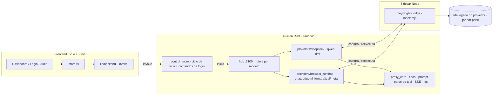
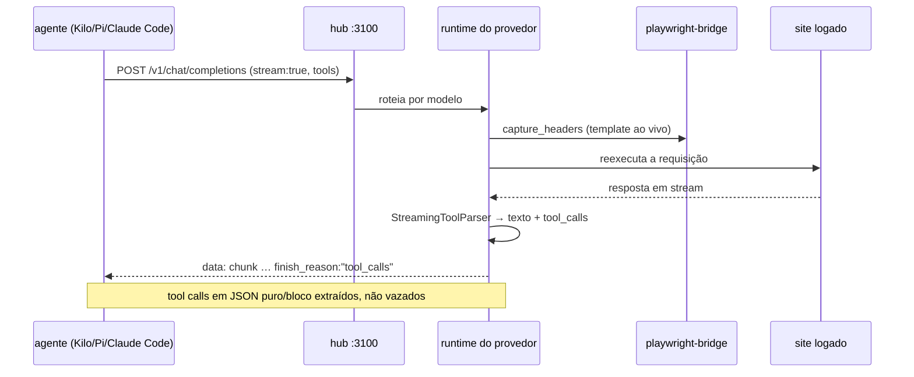
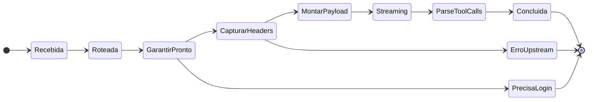
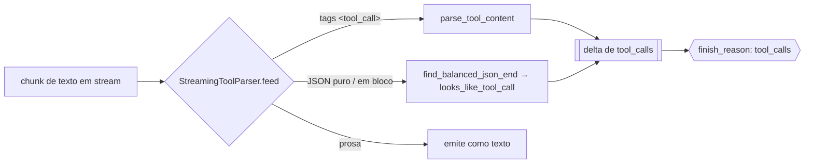
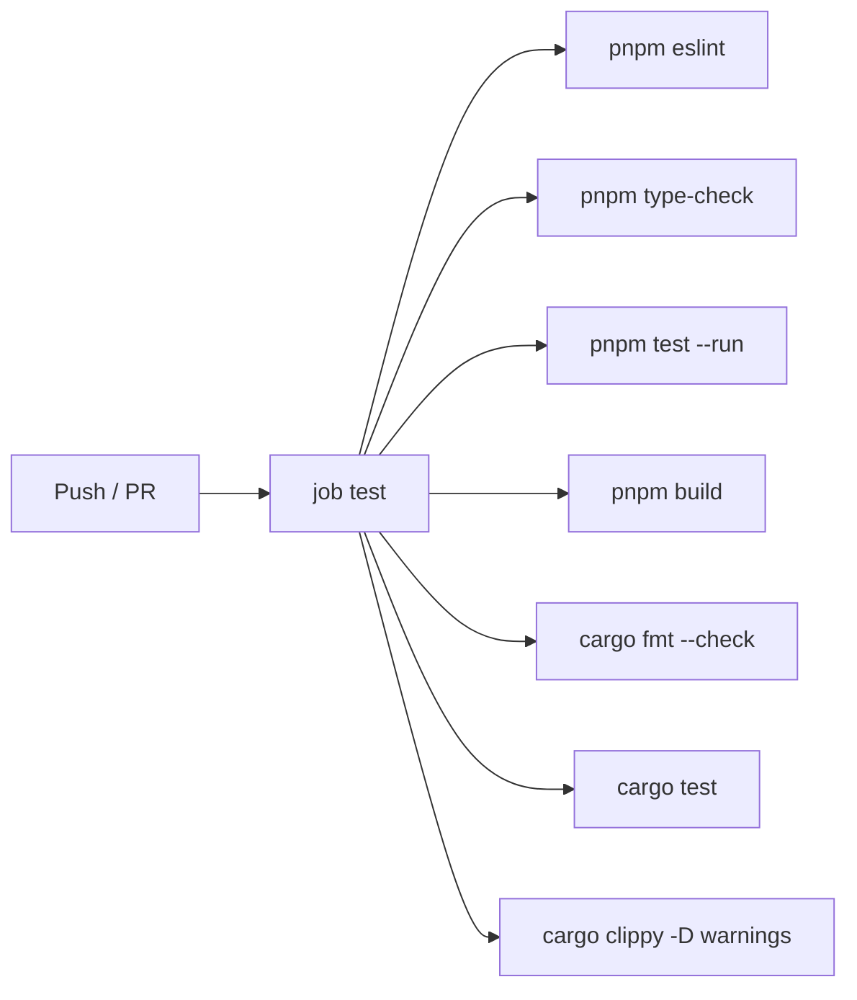
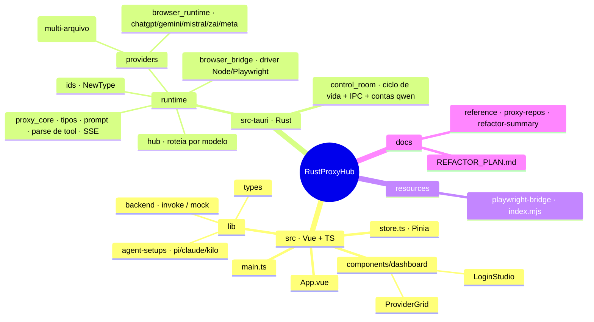

<div align="center">

<h1 align="center">
 RustProxyHub
</h1>

Um cockpit de proxy de LLM local-first e **sem chaves** (keyless). Um único app desktop transforma suas próprias sessões de navegador já logadas em oito provedores de IA em um único endpoint compatível com OpenAI e Anthropic — aponte qualquer agente de código para ele: sem API keys, sem cobrança por token, sem nuvem, seus cookies nunca saem da máquina. Feito com Tauri v2 (Rust) + Vue 3.

<p align="center">
 
 
 
 
 
 
</p>

[English](README.md) · **Português (BR)**

</div>

---

<h1 align="center">
 
 Demo | Central de Comando
</h1>

```
 RustProxyHub v2.11.2                       hub: http://127.0.0.1:3100 · OpenAI + Anthropic

 ──────────────────────────────────────────────────────────────────────────
   Provedores                                          ● logado    ✕ deslogado
 ──────────────────────────────────────────────────────────────────────────
  ● deepseek   ● qwen   ✕ kimi   ● chatgpt   ✕ gemini        [ Abrir sessão ]
 ──────────────────────────────────────────────────────────────────────────
   Feed de modelos  (/v1/models · unificado entre provedores)   8 provedores · streaming ●
 ──────────────────────────────────────────────────────────────────────────
  deepseek-v4-pro            · deepseek   · thinking
  deepseek-v4-vision         · deepseek   · vision
  qwen-plus-2025-07-28       · qwen       · busca web
 ──────────────────────────────────────────────────────────────────────────
  [Runtime ▸ saudável]  tools: JSON puro + em bloco parseado    Login Studio ▸ pronto
 ──────────────────────────────────────────────────────────────────────────

 ▶ Aponte qualquer cliente OpenAI/Anthropic para o hub — suas sessões logadas fazem o resto.
```

---

<h1 align="center">
  Provedores Suportados
</h1>

| Provedor | Runtime | Porta | Chat | Stream | Tools | Visão | Busca web |
|---|---|---|:---:|:---:|:---:|:---:|:---:|
| **DeepSeek** | nativo | 3001 | ✓ | ✓ | ✓ | ✓ | ✓ |
| **Qwen** | nativo | 3000 | ✓ | ✓ | ✓ | ~¹ | ✓ |
| **Kimi** | nativo | 3002 | ✓ | ✓ | ✓ | ✗ | ✗ |
| **ChatGPT** | browser | 3003 | ✓ | ✓ | ✓ | ✗ | ✗ |
| **Gemini** | browser | 3004 | ✓ | ✓ | ✓ | ✗ | ✗ |
| **Mistral** | browser | 3005 | ✓ | ✓ | ✓ | ✗ | ✗ |
| **Z.ai** (GLM) | browser | 3006 | ✓ | ✓ | ✓ | ✗ | ✗ |
| **Meta AI** | browser | 3007 | ✓ | ✓ | ✓ | ✗ | ✗ |

<sup>**Tools** — best-effort: o proxy injeta o schema da ferramenta no prompt e faz o parse das chamadas de volta (tags `<tool_call>` **ou** JSON puro / em bloco), então a acurácia acompanha o modelo. Tipos OpenAI `function` **e** `custom`, além de `tool_choice` `auto`/`required`/`none`/nomeada/`allowed_tools`. · **Visão**: ✓ = `deepseek-v4-vision`; ~¹ Qwen = **upload** de imagem/arquivo (`/v1/upload`), não um modelo de chat com visão. · **Busca web**: verificado no servidor (`qwen`, `deepseek`).</sup>

> O **hub** na `:3100` agrega todos os provedores acima atrás de uma única superfície compatível com OpenAI/Anthropic e roteia cada requisição para um provedor inferindo-o pelo nome do modelo.

---

<h1 align="center">Como Funciona</h1>


---

<h1 align="center">
  Recursos
</h1>

* **Um endpoint, oito provedores**: o hub expõe uma única superfície compatível com OpenAI **e** Anthropic (`/v1/chat/completions`, `/v1/messages`, `/v1/models`, `/v1/responses`) e roteia pelo nome do modelo — seu agente nunca sabe que existem oito backends
* **Sem API keys**: cada provedor é dirigido por uma **sessão de navegador real e logada**; o proxy captura o template de requisição ao vivo e o reexecuta — sua assinatura, sem cobrança por token
* **Streaming SSE ao vivo**: as respostas voltam como eventos OpenAI `chat.completion.chunk` com um `finish_reason` de encerramento — uma única camada de framing compartilhada por todos os provedores
* **Tool calling que realmente dispara**: um único `StreamingToolParser` extrai as chamadas de ferramenta seja o modelo emitindo tags `<tool_call>` **ou** JSON puro / em bloco ```` ``` ```` (única, múltipla, ou dividida entre chunks do stream) — então Kilo, Pi e Claude Code recebem `tool_calls` reais, não texto vazado
* **DeepSeek Vision**: `deepseek-v4-vision` alterna o chat para o modo visão (só disponível no chat da web, alcançável apenas pela sessão do navegador)
* **Múltiplas contas Qwen**: sessões logadas por conta em um SQLite local, mascaradas em toda resposta de API/IPC
* **Snippets de configuração de agente**: um clique gera config pronta para colar no Pi (`models.json`), Claude Code (`settings.json`) e Kilo apontando para o hub
* **Login Studio**: abra, acompanhe e feche o login de navegador de cada provedor pelo dashboard; as sessões persistem no app-data
* **Detecção de runtime multiplataforma**: encontra qualquer navegador da família Chromium instalado (Edge / Chrome / Chromium) e o binário certo do Node por plataforma
* **Local-first**: SQLite em disco, sessões no diretório app-data do SO; nada sai da máquina

---

<h1 align="center">
  Stack Técnica
</h1>

<p align="center">
 
</p>

* **Shell / Runtime**: Tauri v2 (núcleo Rust + WebView do sistema), binário desktop único
* **Backend**: Rust 2021 · `tokio` async · HTTP `axum` · cliente upstream `reqwest` (rustls) · `rusqlite` (SQLite embutido) · erros com `anyhow` · **newtypes** de ids de domínio
* **Frontend**: Vue 3 · TypeScript · Vite · estado com Pinia · HugeIcons · um design system escuro estilo macOS feito à mão (tokens em `src/assets/main.css`)
* **Ponte de navegador**: um helper **Node + Playwright** embutido (`resources/playwright-bridge/index.mjs`) que o lado Rust dirige via JSON para automatizar a sessão logada; `node.exe` + runtime do Playwright vão dentro do bundle no Windows
* **Armazenamento**: SQLite (contas Qwen) no diretório app-data; as sessões dos provedores persistem por perfil
* **CI/CD**: GitHub Actions — ESLint · typecheck `vue-tsc` · Vitest · build do frontend · `cargo fmt --check` · `cargo test` · `cargo clippy -D warnings`
* **Qualidade**: `rustfmt` · Clippy · ESLint · Prettier · Vitest
* **Empacotamento**: Windows NSIS `-setup.exe` + `tauri-app.exe` portátil (empacota Node + o helper Playwright)

---

<h1 align="center">
 
 Instalação & Configuração
</h1>

```bash
git clone https://github.com/SobralCybersec/RustProxyHub.git
cd RustProxyHub
pnpm install
```

### Requisitos

- **Rust** (stable) + Cargo
- **Node** 20+ e **pnpm**
- Um **navegador da família Chromium** — Microsoft Edge, Chrome ou Chromium (a ponte dirige o engine `chromium` com um canal `msedge`/`chrome`)
- **Dependências de sistema no Linux** (Tauri v2 / WebKitGTK):
  ```bash
  # Debian/Ubuntu
  sudo apt-get install -y libwebkit2gtk-4.1-dev libgtk-3-dev \
    libayatana-appindicator3-dev librsvg2-dev
  ```
- Uma sessão de navegador logada por provedor (feita uma vez pelo **Login Studio**)

### Executar (desenvolvimento)

```bash
# App desktop completo — runtime Rust + dashboard
pnpm tauri dev

# Só o frontend (rápido; backend mock no navegador, sem Rust)
pnpm dev            # → vite na :1420
```

> Dentro da janela do Tauri o dashboard chama o backend Rust real; aberto como uma aba comum de navegador (`vite`), ele cai num mock em memória para a UI renderizar mesmo sem backend.

### Build (release)

```bash
# Smoke-check do empacotamento debug (recursos de runtime embutidos)
pnpm tauri build --debug

# Windows — NSIS -setup.exe + exe portátil (empacota Node + Playwright)
pnpm release:windows
```

### Verificar (os mesmos gates do CI, localmente)

```bash
pnpm verify
# = eslint · type-check vue-tsc · vitest · testes Node bridge · build do frontend
#   · cargo audit · pnpm audit
#   · cargo test · cargo clippy --all-targets -D warnings
```

### Cargo Features

| Recurso | Padrão | Efeito |
|---|---|---|
| *(nenhum)* | ✓ | Não há features opcionais de Cargo. A ponte Node + Playwright é sempre embutida; o runtime detecta o navegador e o Node no launch. |

> Uma antiga feature `standalone-provider-cli` (cada provedor como seu próprio binário) foi removida quando os provedores foram unificados no runtime único do Tauri — hoje cada provedor roda in-process atrás do hub.

---

<h1 align="center">
 
 Arquitetura
</h1>

RustProxyHub é um app Tauri v2: um dashboard Vue chama **comandos IPC** Rust tipados para gerenciar o ciclo de vida e os logins dos provedores, enquanto o mesmo processo Rust roda toda a pilha de proxy in-process. Cada provedor reexecuta as requisições contra uma sessão de navegador logada dirigida por um helper Node + Playwright.



### Streaming em tempo real (SSE)

Cada provedor devolve sua resposta em stream como eventos OpenAI `chat.completion.chunk` sobre `text/event-stream`. Uma única camada de framing compartilhada (`proxy_core::sse_json` / `sse_done`) é dona do formato de fio, e um único `StreamingToolParser` reclassifica as chamadas de ferramenta para fora do texto no meio do stream, para que os agentes recebam `tool_calls` reais.



### Superfície da API

O hub fala os dois formatos de fio; os agentes apontam para `http://127.0.0.1:3100`.

| Rota | Finalidade |
|---|---|
| `GET /v1/models` | Lista de modelos unificada entre todos os provedores ativos |
| `POST /v1/chat/completions` | Chat OpenAI (stream ou não, tools, visão) |
| `POST /v1/chat/completions/stop` | Cancela um stream em andamento |
| `POST /v1/responses` | Entrada estilo OpenAI Responses |
| `POST /v1/messages` | Anthropic Messages (Claude Code) |
| `POST /v1/messages/count_tokens` | Contagem de tokens Anthropic |
| `GET /health` · `GET /providers` | Saúde do runtime + por provedor |
| `POST /admin/manual_login` | (por provedor) abre a sessão de login no navegador |

### Ciclo de vida da requisição (máquina de estados)

O dashboard nunca chuta o status — ele segue a saúde do runtime. Uma requisição de chat percorre um caminho fixo; uma sessão ausente cai direto num aviso de login em vez de travar em silêncio.



### Parsing de tool-calls — um único caminho compartilhado

Todo provedor (nativo e browser) roteia seu texto em stream pelo mesmo `StreamingToolParser`. Um modelo pode emitir uma chamada de três formas; as três viram `tool_calls` OpenAI, e o que não é uma chamada real continua como texto.



### Métricas

O runtime do Qwen já expõe telemetria real — `GET /metrics` (Prometheus) e `/admin/status` (JSON), registrados a cada requisição — então qualquer número vem da *sua* máquina, não de marketing:

| Métrica | Tipo | Mede |
|---|---|---|
| `latency.request` | histograma | Latência da requisição (ms), buckets 5 → 5000 |
| `requests.total` · `requests.errors` | counter | Contagem de requisições + erros → taxa de erro |
| `cache.hit` · `cache.miss` | counter | Taxa de acerto do cache de modelos |
| `streams.active` | gauge | Streams SSE ativos |
| `memory.heap.used` | gauge | Memória do processo |

**Benchmark honesto** — dois números, nunca fundidos num único número de vitrine:
- **Overhead do hub** (a velocidade real do código Rust): parse da requisição + roteamento por modelo, medido contra um provedor *mock* com `oha`/`vegeta` — de forma crível **sub-milissegundo a poucos ms**. É o único lugar onde uma afirmação de "rápido" se sustenta.
- **TTFT ponta a ponta**: dominado pela **sessão de navegador** (segundos), não pelo proxy — uma característica do produto medida com `llmperf`/AIPerf contra o endpoint real, nunca um gabarito de velocidade do proxy.
- **Não afirmado**: throughput / req-s / tokens-s / "*N×* mais rápido que *&lt;gateway&gt;*". Uma sessão de navegador é serial e limitada pelo provedor, então esses números descreveriam um mock, não a realidade.

> O sistema de `Métricas` hoje está ligado apenas ao provedor Qwen; estendê-lo para todo o hub é um follow-up rastreado.

---

<h1 align="center">
  GitHub Actions CI/CD
</h1>

### Matriz de Workflow

| Job | Gatilho | Passos |
|---|---|---|
| `test` | push (main) / PR | ESLint · typecheck `vue-tsc` · Vitest · build do frontend · `cargo fmt --check` · `cargo test` · `cargo clippy --all-targets -D warnings` |



> Um job, um contrato: os gates de frontend e Rust compartilham uma única barra verde. `clippy -D warnings` mantém o build padrão livre de warnings.

---

<h1 align="center">
  Estrutura do Projeto
</h1>



---

<h1 align="center">
  Objetivos de Gestão de TI → Métricas
</h1>

> Construí este projeto para demonstrar objetivos clássicos de gestão de TI **na prática**. Cada objetivo abaixo aponta para um artefato verificável — um arquivo, um gate de CI, uma contagem de testes, uma decisão de arquitetura — nunca um número de vitrine. Fiel à seção `Métricas`: se você não consegue abrir o código e conferir, não está aqui.

| # | Objetivo | Entrega no RustProxyHub | Métrica verificável |
|---|---|---|---|
| 1 | **Olhar para o negócio** | Um endpoint único compatível com OpenAI **e** Anthropic consolida oito provedores; o objetivo de negócio (custo zero de token) vira a arquitetura | 8 provedores → 1 endpoint · 2 dialetos de API |
| 2 | **Medir o desempenho da área** | Telemetria real registrada a cada requisição — `GET /metrics` (Prometheus) + `/admin/status` (JSON) | 5 séries: histograma de latência, requests/errors, cache hit/miss, streams ativos, heap |
| 3 | **Alocar custos** | Counters por requisição, erro e cache permitem atribuir consumo por provedor/conta | `requests.total` · `requests.errors` segmentáveis por provedor |
| 4 | **Manter níveis de serviço interno** | Fallback para qualquer Chromium instalado + aviso de login explícito em vez de falha silenciosa | Saúde por requisição exposta em `/admin/status` |
| 5 | **Reduzir custo** | 100% keyless: reusa sessões de navegador já logadas em vez de API keys pagas | US$ 0/token · US$ 0/mês de gateway · 0 chaves |
| 6 | **Otimizar estrutura** | Hotspots O(n²) de streaming eliminados; framing SSE unificado | O(n²) → O(n) · 4 cópias de SSE → 1 |
| 7 | **Ser ágil** | Refactor conduzido por fases, cada fase entregue verde no CI antes de avançar | Cada fase = 1 barra verde antes do merge |
| 8 | **Inovar nas soluções propostas** | Abordagem keyless: sessão de navegador real no lugar de chave/headless | 0 chaves · cookies 100% locais |
| 9 | **Fazer previsões acuradas** | Histograma de latência (buckets 5 → 5000 ms) + gauges alimentam projeção de capacidade | p50/p95 direto dos buckets do histograma |
| 10 | **Não focar em "commodities"** | HTTP/SSE/DB vêm de stacks maduras (axum, tokio, rusqlite); código próprio só no diferencial (roteamento multi-provider) | Lógica autoral concentrada no hub de roteamento |
| 11 | **Gerar informação correta** | Newtypes de ID barram troca em tempo de compilação; zero `unwrap()` fora de teste | 4 newtypes (Model/Session/Account/ParentMessage) · 0 unwrap não-teste |
| 12 | **Manter um Business Intelligence** | Endpoint Prometheus scrapeável (pronto p/ Grafana) + dashboard ao vivo | `/metrics` no formato Prometheus |
| 13 | **Focar em ações de valor** | Testes cobrem caminhos críticos (parse de tool-call, roteamento), não getters triviais | 146 testes verdes em caminhos de valor |
| 14 | **Manter os processos críticos** | Guard RAII (`ActiveStreamGuard`) libera o slot do stream-registry mesmo em desconexão abrupta | 0 vazamento de slot em disconnect |
| 15 | **Manter o ambiente seguro** | Cookies/sessões nunca deixam a máquina; senhas em SQLite local, nunca serializadas em IPC/API | 0 segredos na rede · 0 chaves em disco |
| 16 | **Manter 24×7×365 a infraestrutura** | App local-first sem dependência de nuvem — não há servidor RustProxyHub para cair | 0 dependências de nuvem no caminho crítico |
| 17 | **Modelo reutilizável** | Um parser de tool-call compartilhado por todos os provedores; framing SSE centralizado | 1 parser p/ 8 provedores · 1 dono do framing |
| 18 | **Conquistar o pessoal do negócio** | README bilíngue (EN/pt-BR) + quick-start que realmente roda | 2 idiomas · setup documentado ponta a ponta |
| 19 | **Ser mais eficiente, ser mais eficaz** | CI roda `clippy -D warnings` + `fmt --check` a cada push | 0 warnings no build padrão |
| 20 | **Padronizar processos** | Um job de CI, um contrato: frontend e Rust na mesma barra verde | 7 gates em 1 pipeline por push/PR |
| 21 | **Automatizar tarefas dos usuários** | Detecção cross-platform de browser/node automática, sem configuração manual de caminho | 0 config manual de path |

---

<h1 align="center">
  Limitações & Notas
</h1>

### Fora do Escopo
- **Nenhum provedor por API key**: tudo roda por uma sessão de navegador real e logada; não há modelo headless nem fallback por chave embutido
- **Sem nuvem / sem contas**: tudo é local-first; não existe um servidor RustProxyHub
- **Visão é só-chat no upstream**: `deepseek-v4-vision` alcança o modo visão da web pela sessão; o *upload* de imagem pela ponte é um follow-up rastreado
- **Empacotamento Windows-first**: os artefatos de release são o NSIS `-setup.exe` + exe portátil (Node + Playwright embutidos); Linux/macOS rodam via `pnpm tauri dev`

### Notas & Garantias
- **Cookies nunca saem da máquina** — sessão de navegador por perfil no diretório app-data
- **Login antes de usar** — uma sessão perdida retorna um aviso claro de login em vez de travar em silêncio (abra pelo Login Studio)
- **Tool calls são corretas no fio** — JSON puro/em bloco é reclassificado em `tool_calls` com um `finish_reason:"tool_calls"` de encerramento (usuários do Kilo: defina `toolFormat: native` no provedor)
- **O build padrão continua verde** — o CI roda `clippy -D warnings` a cada push
- **Senhas são locais** — as senhas das contas Qwen vivem no SQLite do app-data, nunca serializadas em respostas de IPC/API

### Aviso Legal

O RustProxyHub automatiza **suas próprias** sessões logadas. Ele **não é afiliado, associado nem endossado** por nenhum dos provedores aos quais se conecta. Automatizar essas sessões web pode violar os termos de serviço de um provedor e pode limitar ou suspender sua conta — você usa **suas próprias contas, por sua conta e risco**. Fornecido para uso pessoal e educacional, no estado em que se encontra, sem garantias.

---

<h1 align="center"> Referências</h1>

> Frameworks centrais, a pilha de automação de navegador e a pesquisa de 2026 sobre proxy / tool-calling que moldaram o runtime. Projetos de terceiros pertencem aos seus autores.

<h2 align="center">

**Tauri v2**: [tauri.app](https://v2.tauri.app/) 

</h2>

<h2 align="center">

**Vue**: [vuejs.org](https://vuejs.org/) · **Vite**: [vite.dev](https://vite.dev/) · **Pinia**: [pinia.vuejs.org](https://pinia.vuejs.org/) 

</h2>

<h2 align="center">

**axum**: [github.com/tokio-rs/axum](https://github.com/tokio-rs/axum) · **tokio**: [tokio.rs](https://tokio.rs/) 

</h2>

<h2 align="center">

**rusqlite / SQLite**: [github.com/rusqlite/rusqlite](https://github.com/rusqlite/rusqlite) · [sqlite.org](https://www.sqlite.org/) 

</h2>

<h2 align="center">

**Playwright**: [playwright.dev](https://playwright.dev/) 

</h2>

<h2 align="center">

**Tool calls em stream da OpenAI (2026)**: [referência de streaming events](https://developers.openai.com/api/reference/resources/chat/subresources/completions/streaming-events) 

</h2>

<h2 align="center">

**Protocolo de tools do Kilo Code**: [Kilo-Org/kilocode](https://github.com/Kilo-Org/kilocode) · **Tool calling nativo do Roo**: [RooCodeInc/Roo-Code](https://github.com/RooCodeInc/Roo-Code) 

</h2>

<h2 align="center">

**DeepSeek-V4 Vision (2026)**: [a baleia agora enxerga — SCMP](https://www.scmp.com/tech/tech-trends/article/3351892/whale-can-now-see-deepseek-adds-ai-vision-major-move) 

</h2>

<h2 align="center">

**Prior art de AI-gateway (Rust, 2026)**: [api7/aisix](https://github.com/api7/aisix) · [tópico llm-proxy](https://github.com/topics/llm-proxy?l=rust) 

</h2>

---

## Índice de pesquisa e documentação

Notas locais: [repositórios de proxy / gateway](docs/reference/proxy-repos-2026.md) · [resumo do refactor](docs/reference/refactor-summary.md) · [economia de tokens e backends de navegador](docs/reference/token-saving-and-browser-backends.md).

Clones de pesquisa em [`research/repos`](research/repos): [AI-Worker-Proxy](https://github.com/zxcloli666/AI-Worker-Proxy) · [CatGPT-Gateway](https://github.com/GautamVhavle/CatGPT-Gateway) · [code-context-engine](https://github.com/elara-labs/code-context-engine) · [copium](https://github.com/iKislay/copium) · [deepsproxy](https://github.com/pedrofariasx/deepsproxy) · [inferock-bench](https://github.com/inferock/inferock-bench) · [kimiproxy](https://github.com/pedrofariasx/kimiproxy) · [kiro2cc-proxy](https://github.com/TsinHzl/kiro2cc-proxy) · [lean-ctx](https://github.com/yvgude/lean-ctx) · [lowfat](https://github.com/zdk/lowfat) · [mimo-code-proxy](https://github.com/pedrofariasx/mimo-code-proxy) · [ollieproxy](https://github.com/pedrofariasx/ollieproxy) · [Patchright](https://github.com/Kaliiiiiiiiii-Vinyzu/patchright) · [Playwright](https://github.com/microsoft/playwright) · [qwenproxy](https://github.com/pedrofariasx/qwenproxy) · [sqz](https://github.com/ojuschugh1/sqz) · [token-savior](https://github.com/Mibayy/token-savior) · [tokensave](https://github.com/Prathamg042004/tokensave) · [tokless](https://github.com/HoangP8/tokless) · [zap](https://github.com/bitan-del/zap).

Referências de design: [api7/aisix](https://github.com/api7/aisix) · [x5iu/llm-proxy](https://github.com/x5iu/llm-proxy) · [KochC/opencode-llm-proxy](https://github.com/KochC/opencode-llm-proxy) · [ParzivalHack/Aegis.rs](https://github.com/ParzivalHack/Aegis.rs) · [tópico Rust LLM-proxy](https://github.com/topics/llm-proxy?l=rust&o=asc&s=updated) · [typestate de Cliffle](https://cliffle.com/blog/rust-typestate/) · [typestate do Comprehensive Rust](https://google.github.io/comprehensive-rust/idiomatic/leveraging-the-type-system/typestate-pattern/typestate-example.html) · [newtype / typestate da Microsoft](https://microsoft.github.io/RustTraining/rust-patterns-book/ch03-the-newtype-and-type-state-patterns.html) · [typestate do Software Patterns Lexicon](https://softwarepatternslexicon.com/rust/idiomatic-rust-patterns/the-typestate-pattern/) · [newtype do Software Patterns Lexicon](https://softwarepatternslexicon.com/rust/idiomatic-rust-patterns/the-newtype-pattern/) · [typestate-builder](https://docs.rs/typestate-builder).
