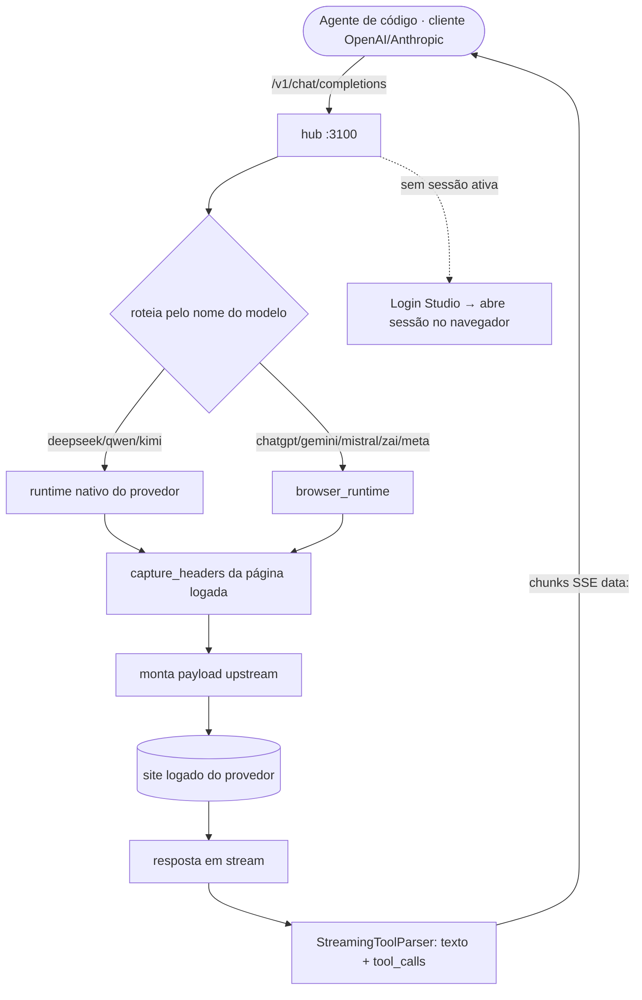
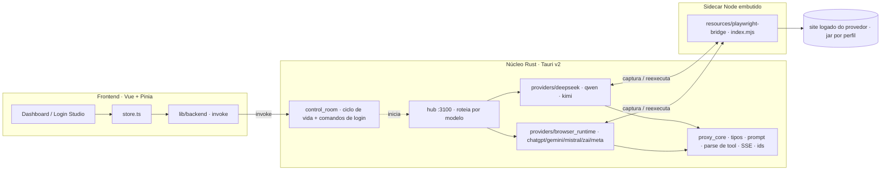
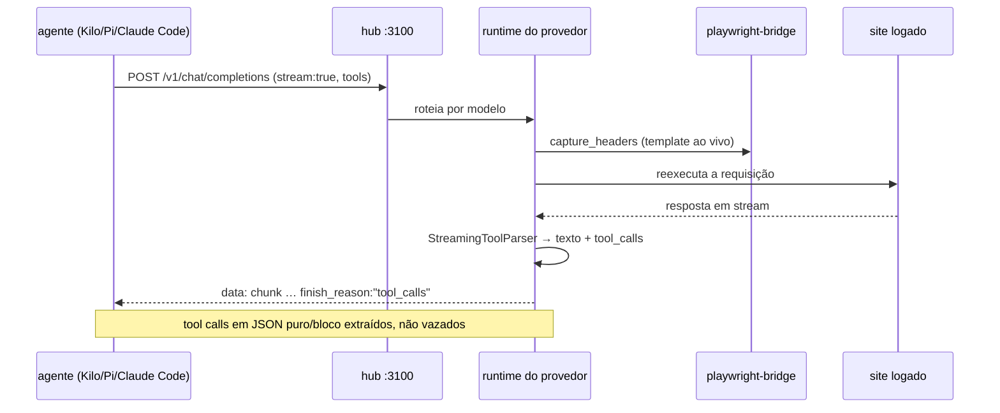
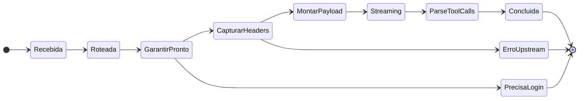
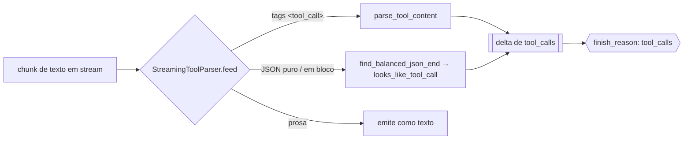
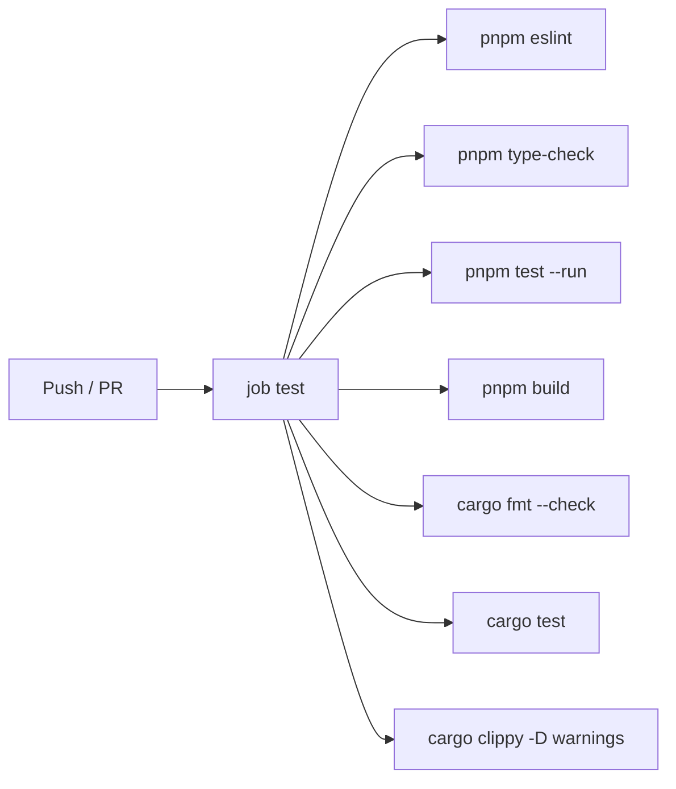
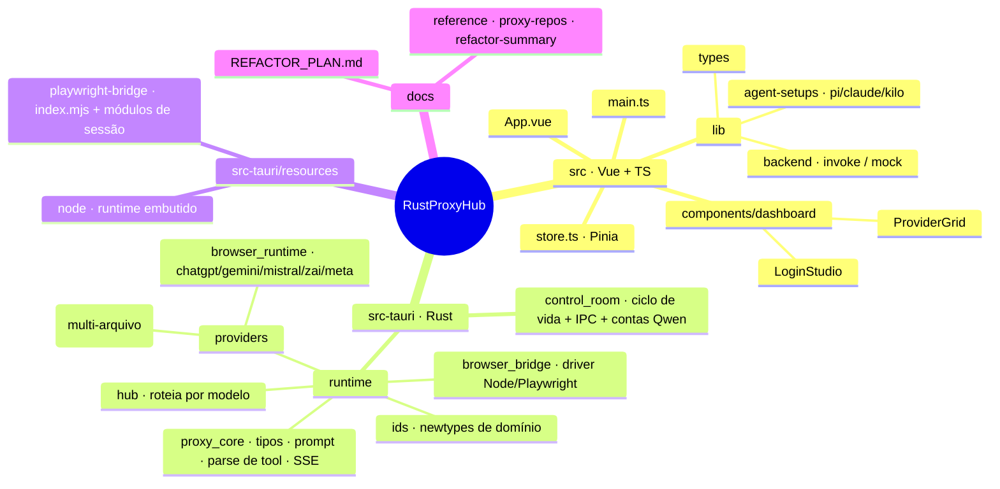

<div align="center">

<h1 align="center">
 RustProxyHub
</h1>

Um cockpit de proxy de LLM local-first e **sem chaves** (keyless). Um único app desktop transforma suas próprias sessões de navegador já logadas em oito provedores de IA em um único endpoint compatível com OpenAI e Anthropic — aponte qualquer agente de código para ele: sem chaves de API do provedor nas sessões via navegador, sem relay cloud do RustProxyHub e com estado de sessão local. Feito com Tauri v2 (Rust) + Vue 3.

<p align="center">
 
 
 
 
 
 
</p>

[English](README.md) · **Português (BR)**

</div>

---

<h1 align="center">
 
 Demo | Central de Comando
</h1>

```
 RustProxyHub v2.11.2                       hub: http://127.0.0.1:3100 · OpenAI + Anthropic

 ──────────────────────────────────────────────────────────────────────────
   Provedores                                          ● logado    ✕ deslogado
 ──────────────────────────────────────────────────────────────────────────
  ● deepseek   ● qwen   ✕ kimi   ● chatgpt   ✕ gemini        [ Abrir sessão ]
 ──────────────────────────────────────────────────────────────────────────
   Feed de modelos  (/v1/models · unificado entre provedores)   8 provedores · streaming ●
 ──────────────────────────────────────────────────────────────────────────
  deepseek-v4-pro            · deepseek   · thinking
  deepseek-v4-vision         · deepseek   · vision
  qwen-plus-2025-07-28       · qwen       · busca web
 ──────────────────────────────────────────────────────────────────────────
  [Runtime ▸ saudável]  tools: JSON puro + em bloco parseado    Login Studio ▸ pronto
 ──────────────────────────────────────────────────────────────────────────

 ▶ Aponte qualquer cliente OpenAI/Anthropic para o hub — suas sessões logadas fazem o resto.
```

---

<h1 align="center">
  Provedores Suportados
</h1>

| Provedor | Runtime | Porta | Chat | Stream | Tools | Visão | Busca web |
|---|---|---|:---:|:---:|:---:|:---:|:---:|
| **DeepSeek** | nativo | 3001 | ✓ | ✓ | ✓ | ✓ | ✓ |
| **Qwen** | nativo | 3000 | ✓ | ✓ | ✓ | ~¹ | ✓ |
| **Kimi** | nativo | 3002 | ✓ | ✓ | ✓ | ✗ | ✗ |
| **ChatGPT** | browser | 3003 | ✓ | ✓ | ✓ | ✗ | ✗ |
| **Gemini** | browser | 3004 | ✓ | ✓ | ✓ | ✗ | ✗ |
| **Mistral** | browser | 3005 | ✓ | ✓ | ✓ | ✗ | ✗ |
| **Z.ai** (GLM) | browser | 3006 | ✓ | ✓ | ✓ | ✗ | ✗ |
| **Meta AI** | browser | 3007 | ✓ | ✓ | ✓ | ✗ | ✗ |

<sup>**Tools** — best-effort: o proxy injeta o schema da ferramenta no prompt e faz o parse das chamadas de volta (tags `<tool_call>` **ou** JSON puro / em bloco), então a acurácia acompanha o modelo. Tipos OpenAI `function` **e** `custom`, além de `tool_choice` `auto`/`required`/`none`/nomeada/`allowed_tools`. · **Visão**: ✓ = `deepseek-v4-vision`; ~¹ Qwen = **upload** de imagem/arquivo (`/v1/upload`), não um modelo de chat com visão. · **Busca web**: verificado no servidor (`qwen`, `deepseek`).</sup>

> O **hub** na `:3100` agrega todos os provedores acima atrás de uma única superfície compatível com OpenAI/Anthropic e roteia cada requisição para um provedor inferindo-o pelo nome do modelo.

---

<h1 align="center">Como Funciona</h1>



---

<h1 align="center">
  Recursos
</h1>

* **Um endpoint, oito provedores**: o hub expõe uma única superfície compatível com OpenAI **e** Anthropic (`/v1/chat/completions`, `/v1/messages`, `/v1/models`, `/v1/responses`) e roteia pelo nome do modelo — seu agente nunca sabe que existem oito backends
* **Sem chaves de API do provedor**: provedores via navegador usam uma **sessão de navegador real e logada**; o proxy captura o template de requisição ao vivo e o reexecuta. O hub local ainda pode ativar `RUST_PROXY_HUB_API_KEY` para autenticar clientes
* **Streaming SSE ao vivo**: as respostas voltam como eventos OpenAI `chat.completion.chunk` com um `finish_reason` de encerramento — uma única camada de framing compartilhada por todos os provedores
* **Tool calling que realmente dispara**: um único `StreamingToolParser` extrai as chamadas de ferramenta seja o modelo emitindo tags `<tool_call>` **ou** JSON puro / em bloco ```` ``` ```` (única, múltipla, ou dividida entre chunks do stream) — então Kilo, Pi e Claude Code recebem `tool_calls` reais, não texto vazado
* **DeepSeek Vision**: `deepseek-v4-vision` alterna o chat para o modo visão (só disponível no chat da web, alcançável apenas pela sessão do navegador)
* **Múltiplas contas Qwen**: sessões logadas por conta em um SQLite local, com senhas omitidas das respostas serializadas de API/IPC
* **Snippets de configuração de agente**: um clique gera config pronta para colar no Pi (`models.json`), Claude Code (`settings.json`) e Kilo apontando para o hub
* **Login Studio**: abra, acompanhe e feche o login de navegador de cada provedor pelo dashboard; as sessões persistem no app-data
* **Detecção de runtime multiplataforma**: encontra qualquer navegador da família Chromium instalado (Edge / Chrome / Chromium) e o binário certo do Node por plataforma
* **Local-first**: SQLite e estado de sessão ficam no diretório app-data do SO; não existe servidor ou relay cloud do RustProxyHub

---

<h1 align="center">
  O que ele economiza
</h1>

O RustProxyHub elimina trabalho repetido de gateway, provedor e agente. São economias de fluxo visíveis no código e na UI, não alegações inventadas de velocidade ponta a ponta.

| Trabalho normalmente repetido | Caminho no RustProxyHub | O que economiza |
|---|---|---|
| Configurar cada cliente de código para cada provedor | Um hub em `127.0.0.1:3100` com rotas OpenAI + Anthropic | URLs base, adapters e trocas de provedor duplicados |
| Manter integrações separadas por provedor | `route by model name` em um único hub Rust | Lógica de roteamento repetida no cliente |
| Reimplementar parsing de tool-call em streaming | Um `StreamingToolParser` + framing SSE compartilhado | Divergência de parser entre oito caminhos de provedor |
| Redigitar credenciais do navegador a cada requisição | Login Studio + sessões locais persistentes | Login e configuração de headers repetidos |
| Diagnosticar uma falha de provedor | `/health`, `/providers`, logs, Qwen `/metrics`, `/admin/status` | Retries cegos e coleta manual de logs |
| Preparar configuração de agente | Snippets do dashboard para Pi, Claude Code e Kilo | Copiar config específica de provedor à mão |
| Hospedar um gateway separado | App Tauri + serviços Rust embutidos | Hosting cloud, deploy e manutenção de gateway |

### Benefícios para CV / portfólio

Este projeto é útil para CV porque um único repositório mostra visão de produto e profundidade de implementação no mesmo artefato:

- **Design de sistemas**: oito runtimes de provedor convergem para um contrato compatível com OpenAI/Anthropic.
- **Backend**: Rust, Tokio, Axum, roteamento, health checks, SSE, cancelamento e erros upstream limitados.
- **Frontend**: Vue 3 + Pinia com health dos provedores, ciclo de login, descoberta de modelos, logs e workbench.
- **Integrações**: Rust dirige uma bridge Node + Playwright embutida e normaliza sessões de provedores via navegador.
- **Confiabilidade**: o stream registry do Qwen usa `ActiveStreamGuard`; cache, watchdog, health e logs expõem o estado do runtime.
- **Segurança**: defaults em loopback, autenticação opcional do hub, respostas de conta mascaradas, armazenamento local e testes SSRF/segredos.
- **Entrega**: CI cobre lint, typecheck, Vitest, testes Node, build Vite, formatação Rust, testes Rust e Clippy.

**Resumo pronto para CV:** *Desenvolvi um gateway LLM local-first em Rust/Tauri que roteia oito provedores via navegador por APIs compatíveis com OpenAI e Anthropic, com parsing SSE de tool-calls, UI de observabilidade em Vue/Pinia, integração Playwright, gestão local de contas/sessões e gates de segurança no CI.*

---

<h1 align="center">
  Stack Técnica
</h1>

<p align="center">
 
</p>

* **Shell / Runtime**: Tauri v2 (núcleo Rust + WebView do sistema), binário desktop único
* **Backend**: Rust 2021 · `tokio` async · `axum` 0.8 · `reqwest` 0.12 com rustls · `rusqlite` 0.31 com SQLite embutido · `serde` · `anyhow`
* **Frontend**: Vue 3.5 · TypeScript 6 · Vite 8 · Pinia 3 · HugeIcons · tokens do control-room escuro em `src/assets/main.css`
* **Ponte de navegador**: helper Node + Playwright 1.60 embutido (`src-tauri/resources/playwright-bridge/index.mjs`) dirigido pelo Rust; `node.exe` e recursos Playwright são preparados antes do empacotamento Tauri
* **Armazenamento**: contas Qwen em SQLite local; dados de runtime/sessão dos provedores no diretório app-data do Tauri
* **CI/CD**: GitHub Actions — ESLint · typecheck `vue-tsc` · Vitest · testes Node bridge · build do frontend · `cargo fmt --check` · `cargo test` · `cargo clippy -D warnings`
* **Qualidade**: `rustfmt` · Clippy · ESLint · Prettier · Vitest · CodeQL · Gitleaks · cargo-audit
* **Empacotamento**: matriz Tauri para Linux `.deb`/AppImage e Windows NSIS/portátil; runtime Node + Playwright embutido

---

<h1 align="center">
 
 Instalação & Configuração
</h1>

```bash
git clone https://github.com/SobralCybersec/RustProxyHub.git
cd RustProxyHub
pnpm install
```

### Requisitos

- **Rust** (stable) + Cargo
- **Node** 20+ e **pnpm**
- Um **navegador da família Chromium** — Microsoft Edge, Chrome ou Chromium (a ponte dirige o engine `chromium` com um canal `msedge`/`chrome`)
- **Dependências de sistema no Linux** (Tauri v2 / WebKitGTK):
  ```bash
  # Debian/Ubuntu
  sudo apt-get install -y libwebkit2gtk-4.1-dev libgtk-3-dev \
    libayatana-appindicator3-dev librsvg2-dev
  ```
- Uma sessão de navegador logada por provedor (feita uma vez pelo **Login Studio**)

### Executar (desenvolvimento)

```bash
# App desktop completo — runtime Rust + dashboard
pnpm tauri dev

# Só o frontend (rápido; backend mock no navegador, sem Rust)
pnpm dev            # → vite na :1420
```

> Dentro da janela do Tauri o dashboard chama o backend Rust real; aberto como uma aba comum de navegador (`vite`), ele cai num mock em memória para a UI renderizar mesmo sem backend.

### Build (release)

```bash
# Smoke-check do empacotamento debug (recursos de runtime embutidos)
pnpm tauri build --debug

# Windows — NSIS -setup.exe + exe portátil (empacota Node + Playwright)
pnpm release:windows
```

### Verificar (os mesmos gates do CI, localmente)

```bash
pnpm verify
# = eslint · type-check vue-tsc · vitest · testes Node bridge · build do frontend
#   · cargo audit · pnpm audit
#   · cargo test · cargo clippy --all-targets -D warnings
```

### Cargo Features

| Recurso | Padrão | Efeito |
|---|---|---|
| *(nenhum)* | ✓ | Não há features opcionais de Cargo. A ponte Node + Playwright é sempre embutida; o runtime detecta o navegador e o Node no launch. |

> Uma antiga feature `standalone-provider-cli` (cada provedor como seu próprio binário) foi removida quando os provedores foram unificados no runtime único do Tauri — hoje cada provedor roda in-process atrás do hub.

---

<h1 align="center">
 
 Arquitetura
</h1>

RustProxyHub é um app Tauri v2: um dashboard Vue chama **comandos IPC** Rust tipados para gerenciar o ciclo de vida e os logins dos provedores, enquanto o mesmo processo Rust roda toda a pilha de proxy in-process. Provedores via navegador reexecutam requisições por um helper Node + Playwright. O ChatGPT suporta sessões web no navegador e credenciais OAuth para o upstream Codex `/responses`.



### Streaming em tempo real (SSE)

Cada provedor devolve sua resposta em stream como eventos OpenAI `chat.completion.chunk` sobre `text/event-stream`. Uma única camada de framing compartilhada (`proxy_core::sse_json` / `sse_done`) é dona do formato de fio, e um único `StreamingToolParser` reclassifica as chamadas de ferramenta para fora do texto no meio do stream, para que os agentes recebam `tool_calls` reais.



### Superfície da API

O hub fala os dois formatos de fio; os agentes apontam para `http://127.0.0.1:3100`.

| Rota | Finalidade |
|---|---|
| `GET /v1/models` | Lista de modelos unificada entre todos os provedores ativos |
| `POST /v1/chat/completions` | Chat OpenAI (stream ou não, tools, visão) |
| `POST /v1/chat/completions/stop` | Cancela um stream em andamento |
| `POST /v1/responses` | Entrada estilo OpenAI Responses |
| `POST /v1/messages` | Anthropic Messages (Claude Code) |
| `POST /v1/messages/count_tokens` | Contagem de tokens Anthropic |
| `GET /health` · `GET /providers` | Saúde do runtime + por provedor |
| `POST /admin/manual_login` | (por provedor) abre a sessão de login no navegador |

### Smoke de tool-call por provedor

Inicie o runtime desktop (`pnpm tauri dev`) e, no Login Studio, inicie o Hub e os provedores a exercitar. Com esse runtime em execução, isto envia uma requisição OpenAI com function-call e streaming para cada modelo retornado por `GET /v1/models`, depois imprime metadados JSON de provedor/modelo/SSE e logs da bridge do provedor. Defina `RUST_PROXY_HUB_API_KEY` quando a autenticação do hub estiver ativa.

```bash
pnpm smoke:provider-tools
# ou: pnpm smoke:provider-tools -- --hub http://127.0.0.1:3100 --api-key "$RUST_PROXY_HUB_API_KEY"
```

`tests/node/provider-tool-smoke.test.mjs` cria um Hub HTTP isolado numa porta efêmera, injeta `RUST_PROXY_HUB_URL` / `RUST_PROXY_HUB_API_KEY` temporários neste CLI e remove o servidor após o teste. Ele cobre as oito rotas de provedor (`chatgpt`, `deepseek`, `gemini`, `kimi`, `meta`, `mistral`, `qwen`, `zai`) e verifica autenticação, schema de function forçada, `tool_calls` em streaming, `[DONE]` final e um log por rota. O smoke real fica separado: ele verifica sessões logadas reais e mostra os logs da bridge sem persistir segredos ou artefatos de teste.

Para CLIs externos de código, configure a URL base OpenAI-compatível documentada pelo cliente como `http://127.0.0.1:3100/v1`; para clientes Anthropic-compatíveis, use `http://127.0.0.1:3100`, mantendo `/v1/messages` acessível. Execute o smoke após configurar o cliente para verificar resposta no fio e logs do provedor.

### Smoke de interação de prompt para clientes de código

```bash
pnpm smoke:client-interactions
# somente um cliente
pnpm smoke:client-interactions -- --client claude
```

Ele cria um follow-up após resultado de tool para cada modelo de provedor descoberto. Verifica prompt de sistema, prompt de usuário, tool call do assistente, resultado da tool, evento final do stream e resposta `RUST_PROXY_HUB_INTERACTION_CONFIRMED`. Kilo, Pi e OpenCode compartilham a verificação OpenAI Chat Completions; Claude usa Anthropic Messages. O relatório JSON inclui uma estrutura de configuração para cada cliente.

Use um modelo retornado por `GET /v1/models`, com prefixo do provedor (por exemplo `qwen:qwen3`):

Os campos seguem a documentação atual de [Kilo](https://kilo.ai/docs/ai-providers/openai-compatible), [Claude Code gateway](https://docs.anthropic.com/en/docs/claude-code/llm-gateway), [Pi](https://github.com/badlogic/pi-mono/blob/main/packages/coding-agent/docs/models.md) e [OpenCode](https://opencode.ai/docs/providers).

| Cliente | Ligação ao Hub |
|---|---|
| Kilo Code | Adicione provedor **OpenAI Compatible** na UI de provedores. Defina Base URL como `http://127.0.0.1:3100/v1`, API key de `RUST_PROXY_HUB_API_KEY` e selecione um modelo descoberto. |
| Claude Code | `export ANTHROPIC_BASE_URL=http://127.0.0.1:3100` e `export ANTHROPIC_AUTH_TOKEN="$RUST_PROXY_HUB_API_KEY"`; selecione um modelo do Hub suportado pelo cliente. |
| Pi | Adicione `rust_proxy_hub` em `~/.pi/agent/models.json` com `baseUrl: "http://127.0.0.1:3100/v1"`, `api: "openai-completions"`, `apiKey: "RUST_PROXY_HUB_API_KEY"`, `authHeader: true` e o modelo selecionado. |
| OpenCode | Adicione provedor `@ai-sdk/openai-compatible` em `opencode.json` com `options.baseURL: "http://127.0.0.1:3100/v1"`, `options.apiKey: "{env:RUST_PROXY_HUB_API_KEY}"` e o modelo selecionado. |

O servidor temporário usado por `tests/node/provider-tool-smoke.test.mjs` executa este CLI com URL/chave isoladas, verifica formatos OpenAI e Anthropic e encerra após o teste.

### Benchmarks do caminho de tools

```bash
pnpm benchmark:provider-tools          # parse SSE + montagem da tool call no Node
pnpm benchmark:rust-tools              # StreamingToolParser Rust em release
pnpm benchmark:provider-interactions   # Hub com sessão salva + até 8 modelos/provedor + histórico
pnpm benchmark:provider-interactions -- --max-models-per-provider 0  # todos modelos buscados
BENCH_ITERATIONS=50000 pnpm benchmark:provider-tools
```

Ambos aquecem antes e emitem JSON com milissegundos, iterações, operações/segundo e tool calls detectadas. Eles medem apenas o overhead do parser—não latência do provedor, automação de navegador ou throughput do modelo—para manter comparações locais úteis sem sugerir uma métrica fim a fim.

`benchmark:provider-interactions` usa o Hub em execução e suas sessões salvas de provedores, busca `GET /v1/models` e executa uma tool call determinística e duas interações prompt → tool-result (OpenAI e Anthropic). Por padrão agenda até oito modelos por provedor; use `--max-models-per-provider 0` para executar cada modelo buscado. Ele acrescenta observações completas de resposta/log em `benchmark-history/provider-model-history.jsonl` e regenera `benchmark-history/provider-model-history.md` com todas as execuções e prévias da saída mais recente. Cada execução termina com tempo total; contagens de modelos/provedores buscados, agendados e funcionais; além de logs buscados e entradas de log. Use `--iterations N` somente mantendo Hub, conjunto de modelos, contrato de prompt e configuração de cliente fixos; a latência observada inclui tempo do provedor/navegador e não é comparação de throughput. A fonte JSONL somente-acréscimo e o índice Markdown gerado seguem [JSON Lines](https://jsonlines.org/) e a orientação de harness fixo no [playbook de avaliações da OpenAI](https://openai.com/index/trustworthy-third-party-evaluations-foundations/).

### Ciclo de vida da requisição (máquina de estados)

O dashboard nunca chuta o status — ele segue a saúde do runtime. Uma requisição de chat percorre um caminho fixo; uma sessão ausente cai direto num aviso de login em vez de travar em silêncio.



### Parsing de tool-calls — um único caminho compartilhado

Todo provedor (nativo e browser) roteia seu texto em stream pelo mesmo `StreamingToolParser`. Um modelo pode emitir uma chamada de três formas; as três viram `tool_calls` OpenAI, e o que não é uma chamada real continua como texto.



### Métricas

O runtime do Qwen expõe telemetria local em `GET /metrics` (texto Prometheus) e `GET /admin/status` (JSON). O hub expõe health em `GET /health`, health dos provedores em `GET /providers` e logs em `GET /providers/{provider}/logs`.

| Família de métrica | Tipo | Mede |
|---|---|---|
| `requests.total` · `requests.errors` | counters | Volume e erros de requisições Qwen |
| `streams.active` · `streams.errors` | gauge/counter | Streams SSE ativos e falhas de stream |
| `cache.*` | counters/histograms | Operações de cache, hits, misses, tamanho e latência |
| `watchdog.*` | gauges/counters | Status de RAM/geral e tentativas de recuperação |
| `memory.heap.*` | gauges | Memória usada e memória total |
| `latency.request` | histograma | Latência com buckets de 5–5000 ms |

O código registra **19 definições de métricas Qwen**. Use `/metrics` ou `/admin/status` na instância em execução para valores reais; o README não faz alegação de velocidade do proxy ou TTFT ponta a ponta, pois a latência do provedor/navegador domina.

---

<h1 align="center">
  GitHub Actions CI/CD
</h1>

### Matriz de Workflow

| Job | Gatilho | Passos |
|---|---|---|
| `test` | push (main) / PR | ESLint · typecheck `vue-tsc` · Vitest · build do frontend · `cargo fmt --check` · `cargo test` · `cargo clippy --all-targets -D warnings` |



> Um job, um contrato: os gates de frontend e Rust compartilham uma única barra verde. `clippy -D warnings` mantém o build padrão livre de warnings.

---

<h1 align="center">
  Estrutura do Projeto
</h1>



---

<h1 align="center">
  Objetivos de Gestão de TI → Métricas
</h1>

> Construí este projeto para demonstrar objetivos clássicos de gestão de TI **na prática**. Cada objetivo abaixo aponta para um artefato verificável — um arquivo, um gate de CI, uma contagem de testes, uma decisão de arquitetura — nunca um número de vitrine. Fiel à seção `Métricas`: se você não consegue abrir o código e conferir, não está aqui.

| # | Objetivo | Entrega no RustProxyHub | Métrica verificável |
|---|---|---|---|
| 1 | **Olhar para o negócio** | Um endpoint único compatível com OpenAI **e** Anthropic consolida oito provedores; o objetivo é acesso mais simples dos agentes e menos duplicação de gateway | 8 provedores → 1 endpoint · 2 dialetos de API |
| 2 | **Medir o desempenho da área** | Qwen expõe `/metrics` Prometheus e `/admin/status` JSON; o hub expõe `/health` e `/providers` | 19 definições de métricas Qwen registradas |
| 3 | **Alocar custos** | Counters de requisição, erro, cache, stream e watchdog criam uma base local para revisar uso por provedor/conta | `requests.total` · `requests.errors` · `cache.*` |
| 4 | **Manter níveis de serviço interno** | Health no dashboard, readiness dos provedores, estado de login, últimos erros e status degraded evitam falha silenciosa | `/health` + `/providers` + cards de status |
| 5 | **Reduzir custo** | Sessões via navegador evitam API key obrigatória do provedor e hosting separado do gateway; termos da assinatura continuam valendo | 1 hub local · 0 serviços cloud do RustProxyHub |
| 6 | **Otimizar estrutura** | Roteamento, framing SSE, parsing de tools, storage de sessão e ciclo dos provedores compartilhados reduzem código duplicado | 1 dono do roteamento · 1 parser compartilhado |
| 7 | **Ser ágil** | Módulos pequenos de provedor compartilham um contrato estável e um workbench local, permitindo exercitar um provedor sem mudar todo cliente | 8 adapters de provedor atrás de um contrato |
| 8 | **Inovar nas soluções propostas** | Uma sessão de navegador real e logada vira a fronteira de integração em vez de um conector obrigatório por API key | Browser bridge + Login Studio local |
| 9 | **Fazer previsões acuradas** | Histograma de latência, gauges de streams, counters de cache, estado do watchdog e workflow semanal de custo de build fornecem entradas mensuráveis | buckets de 5–5000 ms · relatório semanal de build |
| 10 | **Não focar em "commodities"** | Crates maduras cuidam de HTTP, async, JSON e SQLite; o código do projeto concentra-se em roteamento, normalização, browser e compatibilidade com agentes | `axum` · `tokio` · `reqwest` · `rusqlite` reutilizados |
| 11 | **Gerar informação correta** | Newtypes de domínio, DTOs tipados, resumos de conta mascarados, erros limitados e testes de roteamento protegem a qualidade da informação | 4 newtypes de ID · DTOs tipados de health/modelos |
| 12 | **Manter um Business Intelligence** | Prometheus, status JSON, logs de provedor, gráficos do dashboard e histórico de benchmark append-only expõem evidência operacional | `/metrics` · `/admin/status` · `benchmark-history/` |
| 13 | **Focar em ações de valor** | Testes focam routing, parsing de tools, sessões OAuth/web, compactação de prompt, contas, limpeza de streams, smoke dos provedores e fluxos UI | 197 attrs de teste Rust · 33 testes Node · 20 testes Vitest |
| 14 | **Manter os processos críticos** | Guard RAII (`ActiveStreamGuard`) libera o slot do stream registry quando o cliente desconecta antes da limpeza normal | Testes dedicados de descarte do guard |
| 15 | **Manter o ambiente seguro** | Defaults em loopback, auth opcional do hub, chaves encaminhadas somente a serviços locais, contas mascaradas, guards SSRF e secret scans reduzem exposição | workflows Gitleaks + CodeQL + cargo-audit |
| 16 | **Manter 24×7×365 a infraestrutura** | O caminho crítico é local e não depende de servidor RustProxyHub; health checks e watchdog tornam degradação visível | 0 dependências cloud do RustProxyHub |
| 17 | **Modelo reutilizável** | Um `StreamingToolParser`, helpers SSE, IDs tipados e comandos comuns de ciclo dos provedores servem múltiplos runtimes | 1 parser compartilhado entre runtimes |
| 18 | **Conquistar o pessoal do negócio** | UI/README bilíngues, snippets de setup de agentes, status no dashboard e quick-start traduzem capacidade técnica em fluxo de usuário | Português + English · snippets Pi/Claude/Kilo |
| 19 | **Ser mais eficiente, ser mais eficaz** | CI combina checks frontend/Rust; workflows de release e performance deixam custo de build e artefatos visíveis | 8 gates de CI · workflow semanal de custo |
| 20 | **Padronizar processos** | GitHub Actions pinados, um contrato `pnpm verify`, rotas compartilhadas e endpoints consistentes de health/log padronizam a entrega | 7 workflows · um comando local de verificação |
| 21 | **Automatizar tarefas dos usuários** | Login Studio, descoberta de modelos, roteamento, snippets, detecção de browser, startup de sessão e cancelamento removem tarefas manuais | 8 sessões de provedor gerenciadas por um dashboard |

---

<h1 align="center">
  Limitações & Notas
</h1>

### Fora do Escopo
- **Sem fallback por API key de provedor**: provedores via navegador exigem sessão real e logada; a API key local opcional protege o acesso do cliente, não o billing upstream
- **Sem nuvem / sem control plane hospedado**: tudo é local-first; não existe um servidor RustProxyHub
- **Visão é só-chat no upstream**: `deepseek-v4-vision` alcança o modo visão da web pela sessão; o *upload* de imagem pela ponte é um follow-up rastreado
- **Matriz de empacotamento**: releases com tag geram Linux `.deb`/AppImage e Windows NSIS/portátil; Linux/macOS podem rodar via `pnpm tauri dev`

### Notas & Garantias
- **Estado de sessão local** — dados de runtime dos provedores ficam no app-data; requisições do navegador ainda vão para os sites dos provedores
- **Login antes de usar** — uma sessão perdida retorna um aviso claro de login em vez de travar em silêncio (abra pelo Login Studio)
- **Tool calls são corretas no fio** — JSON puro/em bloco é reclassificado em `tool_calls` com um `finish_reason:"tool_calls"` de encerramento (usuários do Kilo: defina `toolFormat: native` no provedor)
- **O build padrão continua verde** — o CI roda `clippy -D warnings` a cada push
- **Senhas são locais e mascaradas** — as senhas Qwen vivem no SQLite do app-data e são omitidas das respostas IPC/API; criptografia em repouso continua como follow-up

### Aviso Legal

O RustProxyHub automatiza **suas próprias** sessões logadas. Ele **não é afiliado, associado nem endossado** por nenhum dos provedores aos quais se conecta. Automatizar essas sessões web pode violar os termos de serviço de um provedor e pode limitar ou suspender sua conta — você usa **suas próprias contas, por sua conta e risco**. Fornecido para uso pessoal e educacional, no estado em que se encontra, sem garantias.

---

<h1 align="center"> Referências</h1>

> Frameworks centrais, a pilha de automação de navegador e a pesquisa de 2026 sobre proxy / tool-calling que moldaram o runtime. Projetos de terceiros pertencem aos seus autores.

<h2 align="center">

**Tauri v2**: [tauri.app](https://v2.tauri.app/) 

</h2>

<h2 align="center">

**Vue**: [vuejs.org](https://vuejs.org/) · **Vite**: [vite.dev](https://vite.dev/) · **Pinia**: [pinia.vuejs.org](https://pinia.vuejs.org/) 

</h2>

<h2 align="center">

**axum**: [github.com/tokio-rs/axum](https://github.com/tokio-rs/axum) · **tokio**: [tokio.rs](https://tokio.rs/) 

</h2>

<h2 align="center">

**rusqlite / SQLite**: [github.com/rusqlite/rusqlite](https://github.com/rusqlite/rusqlite) · [sqlite.org](https://www.sqlite.org/) 

</h2>

<h2 align="center">

**Playwright**: [playwright.dev](https://playwright.dev/) 

</h2>

<h2 align="center">

**Tool calls em stream da OpenAI (2026)**: [referência de streaming events](https://developers.openai.com/api/reference/resources/chat/subresources/completions/streaming-events) 

</h2>

<h2 align="center">

**Protocolo de tools do Kilo Code**: [Kilo-Org/kilocode](https://github.com/Kilo-Org/kilocode) · **Tool calling nativo do Roo**: [RooCodeInc/Roo-Code](https://github.com/RooCodeInc/Roo-Code) 

</h2>

<h2 align="center">

**DeepSeek-V4 Vision (2026)**: [a baleia agora enxerga — SCMP](https://www.scmp.com/tech/tech-trends/article/3351892/whale-can-now-see-deepseek-adds-ai-vision-major-move) 

</h2>

<h2 align="center">

**Prior art de AI-gateway (Rust, 2026)**: [api7/aisix](https://github.com/api7/aisix) · [tópico llm-proxy](https://github.com/topics/llm-proxy?l=rust) 

</h2>

---

## Índice de pesquisa e documentação

Notas locais: [repositórios de proxy / gateway](docs/reference/proxy-repos-2026.md) · [resumo do refactor](docs/reference/refactor-summary.md) · [economia de tokens e backends de navegador](docs/reference/token-saving-and-browser-backends.md).

Clones de pesquisa em [`research/repos`](research/repos): [AI-Worker-Proxy](https://github.com/zxcloli666/AI-Worker-Proxy) · [CatGPT-Gateway](https://github.com/GautamVhavle/CatGPT-Gateway) · [code-context-engine](https://github.com/elara-labs/code-context-engine) · [copium](https://github.com/iKislay/copium) · [deepsproxy](https://github.com/pedrofariasx/deepsproxy) · [inferock-bench](https://github.com/inferock/inferock-bench) · [kimiproxy](https://github.com/pedrofariasx/kimiproxy) · [kiro2cc-proxy](https://github.com/TsinHzl/kiro2cc-proxy) · [lean-ctx](https://github.com/yvgude/lean-ctx) · [lowfat](https://github.com/zdk/lowfat) · [mimo-code-proxy](https://github.com/pedrofariasx/mimo-code-proxy) · [ollieproxy](https://github.com/pedrofariasx/ollieproxy) · [Patchright](https://github.com/Kaliiiiiiiiii-Vinyzu/patchright) · [Playwright](https://github.com/microsoft/playwright) · [qwenproxy](https://github.com/pedrofariasx/qwenproxy) · [sqz](https://github.com/ojuschugh1/sqz) · [token-savior](https://github.com/Mibayy/token-savior) · [tokensave](https://github.com/Prathamg042004/tokensave) · [tokless](https://github.com/HoangP8/tokless) · [zap](https://github.com/bitan-del/zap).

Referências de design: [api7/aisix](https://github.com/api7/aisix) · [x5iu/llm-proxy](https://github.com/x5iu/llm-proxy) · [KochC/opencode-llm-proxy](https://github.com/KochC/opencode-llm-proxy) · [ParzivalHack/Aegis.rs](https://github.com/ParzivalHack/Aegis.rs) · [tópico Rust LLM-proxy](https://github.com/topics/llm-proxy?l=rust&o=asc&s=updated) · [typestate de Cliffle](https://cliffle.com/blog/rust-typestate/) · [typestate do Comprehensive Rust](https://google.github.io/comprehensive-rust/idiomatic/leveraging-the-type-system/typestate-pattern/typestate-example.html) · [newtype / typestate da Microsoft](https://microsoft.github.io/RustTraining/rust-patterns-book/ch03-the-newtype-and-type-state-patterns.html) · [typestate do Software Patterns Lexicon](https://softwarepatternslexicon.com/rust/idiomatic-rust-patterns/the-typestate-pattern/) · [newtype do Software Patterns Lexicon](https://softwarepatternslexicon.com/rust/idiomatic-rust-patterns/the-newtype-pattern/) · [typestate-builder](https://docs.rs/typestate-builder).
