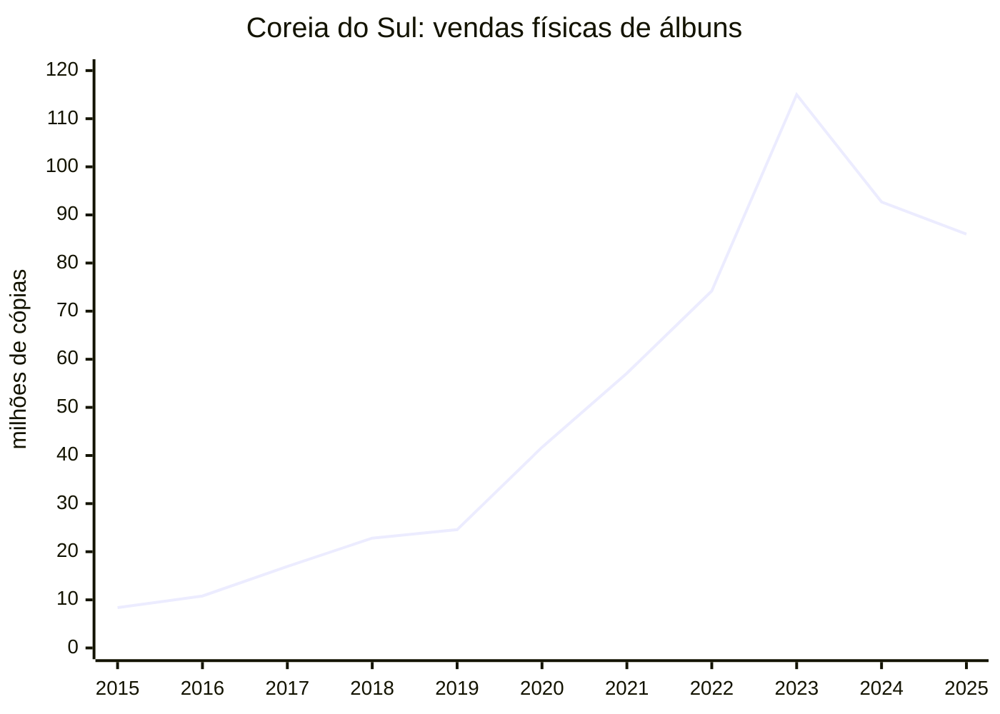
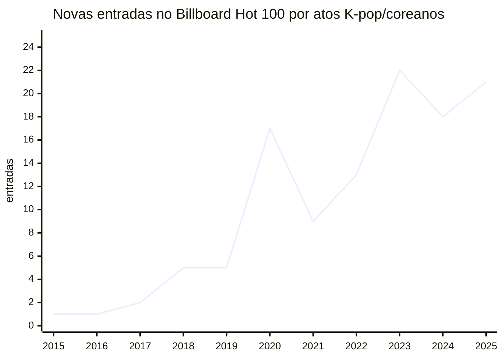
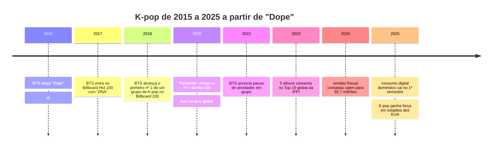

# K-pop depois de Dope

## Resumo executivo

Tomando o MV de **“Dope”** do BTS como **t0 = 23 de junho de 2015**, a melhor leitura dos dados disponíveis não é a de um **declínio linear** do K-pop, mas sim a de uma trajetória em três fases: **expansão estrutural** entre 2015 e 2019, **pico global de centralidade cultural** entre 2020 e 2023, e **correção/fragmentação** entre 2024 e 2025. Em outras palavras: o K-pop ficou muito maior do que era em 2015, mas, em várias frentes, ficou **menos central para o público geral** do que foi no auge BTS/BLACKPINK/pandemia. citeturn0search4turn0search5turn20search12turn40search0turn21search1turn22search2

O dado mais forte a favor da tese de “perda de relevância” está na **Coreia do Sul**: o mercado doméstico de álbuns físicos subiu de **8,38 milhões** de cópias em 2015 para algo entre **115 e 119 milhões** em 2023, mas depois caiu para **92,7 milhões** em 2024 e cerca de **86 milhões** em 2025; além disso, o próprio debate setorial passou a descrever o mercado como saturado, dependente de colecionismo e menos conectado ao público amplo. Em paralelo, o consumo digital doméstico perdeu tração: a própria imprensa setorial reportou queda de **6,4%** no consumo digital das 400 músicas mais consumidas no 1º semestre de 2025, e a longa transição de downloads para streaming já era visível desde 2017. citeturn20search12turn20search16turn14search1turn12news34turn21search1turn22search2turn42view0

O dado mais forte **contra** a tese de declínio é externo: em charts globais, streaming e turnês, o K-pop não desapareceu. Em 2023, **cinco dos dez** álbuns no topo global da IFPI eram de atos coreanos; em 2024, **Seventeen** e **Stray Kids** ficaram no Top 5 do ranking global de artistas da IFPI, e **ENHYPEN** teve o **2º** álbum mais vendido do mundo; em 2025, a IFPI mostrou novamente vários atos coreanos entre os maiores vendedores globais. No Spotify, o playlist **K-Pop ON!** acumulou crescimento de **mais de 5.600%** em streams anuais desde 2015, e o relatório **Loud & Clear** de 2025 classificou o K-pop entre os gêneros globais de crescimento mais rápido em royalties no ano, com **+31%**. No live, a footprint de K-pop em estádios nos EUA saltou de **0,06% para 10%** do panorama de estádios em três anos, segundo StubHub/viagogo. citeturn40search0turn40search11turn40search4turn40search1turn11search9turn10search4turn30search0

A conclusão, portanto, é mais precisa assim: **o K-pop perdeu parte da sua relevância “mainstream generalista” e da sua centralidade narrativa**, sobretudo após a pausa de BTS como grupo em 2022 e após o boom 2020–2023; **mas não perdeu relevância comercial agregada no mesmo grau**. O setor migrou de um modelo de expansão por descoberta ampla para um modelo mais **fandom-driven**, mais **global-localizado**, mais dependente de **colecionáveis/álbuns físicos** e mais concentrado em **superfãs, colaborações internacionais e turnês de grande escala**. citeturn26search4turn27search14turn27search3turn13news33turn25view1turn30search0

## Escopo, método e ponto de partida

Usei o lançamento do MV de **“Dope”** como ponto inicial porque ele marca uma fase anterior ao breakout global pleno do BTS e, por extensão, do K-pop no mercado anglófono. A data adotada para **t0** é **23 de junho de 2015**, que é a data registrada em materiais/coberturas da época para a publicação do clipe. Como 2026 ainda está em curso, o **ano terminal** da série comparável é **2025**, o último ano cheio disponível em várias bases. citeturn0search4turn0search5

Há um problema metodológico importante: **não existe uma série pública, padronizada e completa de “K-pop global”** para todas as métricas pedidas. Por isso, o relatório usa uma combinação de: **Circle/Gaon** para Coreia do Sul; **Billboard** e listas derivadas baseadas em Billboard para penetração global; **IFPI** para vendas/álbuns mundiais; **Spotify** para proxies oficiais de streaming; **Pollstar/Boxscore/veículos que citam esses números** para turnês; e **K-pop Radar** para geografia de consumo no YouTube. Onde não há série pública consistente — principalmente **downloads pagos globais**, **Apple Music por gênero** e **crescimento anual de seguidores por ato em todas as redes** — eu sinalizo a lacuna em vez de inventar continuidade estatística. citeturn23search0turn11search9turn40search1turn25view1

Também é importante distinguir duas coisas que costumam ser misturadas em debates sobre “queda”: **relevância cultural ampla** e **potência de monetização de fandom**. O K-pop pode perder uma parte da primeira e manter — ou até ampliar — a segunda. Essa distinção é central para interpretar por que o mercado doméstico pode esfriar ao mesmo tempo em que o live global e os charts de álbuns equivalentes continuam fortes. citeturn27search14turn27search3turn30search0turn40search0

## Mercado doméstico e sinais de saturação

A série mais clara é a de **álbuns físicos na Coreia do Sul**. Segundo o pesquisador-chefe da Gaon/Circle citado pelo *Korea Times*, as vendas do top 400 passaram de **8,38 milhões** em 2015 para **10,8 milhões** em 2016, **16,93 milhões** em 2017, **22,82 milhões** em 2018, **24,59 milhões** em 2019 e cerca de **42 milhões** em 2020. Depois, Gaon/Yonhap reportaram **57,09 milhões** em 2021 e a Korea.net registrou **74,2 milhões** nas primeiras 50 semanas de 2022. Para 2023, há divergência pública entre “**115 milhões**” e “**mais de 119 milhões**”, mas ambas as leituras confirmam o pico histórico; em seguida, o mercado caiu para **92,7 milhões** em 2024 e cerca de **86 milhões** em 2025. Isso aponta para **forte expansão secular até 2023**, seguida de **correção material** em 2024–2025. citeturn20search12turn20search16turn14search1turn12search11turn12news34turn21search1

Ao mesmo tempo, a própria natureza dessas vendas físicas mudou. Em 2024, a Reuters destacou que **apenas 8%** dos sul-coreanos usam álbuns físicos para ouvir música e que parte importante dessas vendas é puxada por **fotocartas, versões múltiplas e loterias de fan events**, não pelo CD como suporte de escuta. Isso é crucial: a queda de 2024–2025 não significa apenas “menos fãs”; também pode significar que o modelo de hipercolecionismo bateu em limites de saturação. citeturn13news33

No digital doméstico, o sinal também é de esfriamento do K-pop como música de “grande público” dentro da Coreia. Já em 2017, a Yonhap dizia que o mercado estava migrando **de download para streaming**: o número de músicas que passaram de **100 milhões de streams** subiu de **2** em 2016 para **12** em 2017. Nos anos seguintes, as músicas anuais nº 1 do **Circle Digital Chart** perderam teto de pontuação: **1,233 bilhão** de pontos em 2018 (“Love Scenario”), **1,053 bilhão** em 2019, **992 milhões** em 2020, **888 milhões** em 2021, **808 milhões** em 2022, **787 milhões** em 2023 e **590 milhões** em 2024. Em 2025 houve alguma recomposição no topo do chart — **687 milhões** para “Drowning”, de WOODZ —, mas a própria *Korea Herald* reportou queda de **6,4%** no consumo digital total do top 400 no primeiro semestre de 2025. Isso sugere que a “temperatura digital” do mercado doméstico caiu bastante em relação ao fim dos anos 2010 e início dos anos 2020. citeturn42view0turn23search0turn22search2

A inclusão de plataformas internacionais no cálculo do chart também mostra como a estrutura mudou. O **Spotify Korea** passou a entrar no Circle em **dezembro de 2021**, e o **Apple Music Korea** em **julho de 2022**. Ou seja: a partir de 2022, uma parte do consumo Apple já está **indiretamente refletida** no chart coreano, mas **não existe uma série pública anual de Apple Music para K-pop** comparável à do Circle ou da Billboard. citeturn23search0

A saturação fica ainda mais visível quando se olha a oferta. Uma série de debuts compilada pelo SoriData mostra **37 debuts** em 2015, **45** em 2016, **59** em 2017, **43** em 2018, **69** em 2019, **69** em 2020, **54** em 2021, **56** em 2022, **46** em 2023, **55** em 2024 e **52** em 2025. Isso combina com a leitura de excesso de oferta: mais atos competindo por atenção, mais fandoms fragmentados e menos espaço para consenso público. citeturn32view0

### Tabela anual de métricas centrais

| Ano | Álbuns físicos na Coreia do Sul | Debuts de atos K-pop | Novas entradas no Billboard Hot 100 | Observação curta |
|---|---:|---:|---:|---|
| 2015 | 8,38 mi | 37 | 1 | t0 de “Dope”; presença global ainda esparsa |
| 2016 | 10,8 mi | 45 | 1 | início de aceleração física |
| 2017 | 16,93 mi | 59 | 2 | BTS entra no Hot 100; streaming doméstico acelera |
| 2018 | 22,82 mi | 43 | 5 | BTS entra no top 10; BLACKPINK entra no Hot 100 |
| 2019 | 24,59 mi | 69 | 5 | expansão continua, mas ainda concentrada |
| 2020 | 41,71 mi | 69 | 17 | pico da fase BTS/pandemia |
| 2021 | 57,09 mi | 54 | 9 | pico comercial sustentado |
| 2022 | 74,20 mi* | 56 | 13 | pausa de BTS como grupo; mercado ainda cresce |
| 2023 | 115–119 mi** | 46 | 22 | auge global em IFPI e Hot 100 |
| 2024 | 92,7 mi | 55 | 18 | correção física de cerca de 19% |
| 2025 | ~86 mi | 52 | 21*** | digital doméstico em queda, live global forte |

\* 2022 refere-se às primeiras 50 semanas do ano na Korea.net.  
\** 2023 aparece como ~115 mi em algumas reportagens e “mais de 119 mi” em outras; mantive a faixa para transparência.  
\*** Contagem derivada da lista completa de entradas K-pop/coreanas no Hot 100, **excluindo as faixas ficcionais de _KPop Demon Hunters_** para preservar comparabilidade com atos idol/tradicionais.  

Fontes da tabela: Circle/Gaon via *Korea Times*, *Korea Herald*, Yonhap, Korea.net, Reuters e SoriData; Hot 100 derivado de lista completa baseada em registros Billboard. citeturn20search12turn20search16turn14search1turn12search11turn12news34turn21search1turn32view0turn38view0turn39view0

## Penetração global em charts, streaming e busca

Se a pergunta for “o K-pop ficou menos relevante **desde 2015**?”, a resposta global é **não**. O crescimento de penetração internacional foi enorme. No **Billboard Hot 100**, o período 2015–2019 ainda era quase todo carregado por **Psy, BTS e BLACKPINK**. A partir de 2020, a presença explode: BTS emplaca “Dynamite”, “Life Goes On”, “Butter” e “Permission to Dance” em nº 1; depois, 2022–2025 veem uma diversificação com Jungkook, Jimin, NewJeans, FIFTY FIFTY, Le Sserafim, Stray Kids, Rosé, Jennie, Lisa, Ateez e outros. Em 2018, o BTS já havia conseguido um marco ainda mais simbólico: **o primeiro nº 1 no Billboard 200 para um grupo de K-pop** com *Love Yourself: Tear*. citeturn38view0turn39view0turn17news34

A mesma história aparece na **IFPI**, que é um proxy forte para vendas/equivalentes globais. Em 2023, a Reuters reportou que **cinco dos dez** maiores álbuns mundiais da IFPI eram de atos sul-coreanos, o melhor desempenho histórico do K-pop nesse ranking. Em 2024, a IFPI colocou **Seventeen** em **3º** e **Stray Kids** em **5º** no ranking global de artistas, enquanto a Reuters reportou **ENHYPEN** em **2º** no **Global Album Sales Chart** com *Romance: Untold*. Em 2025, o site da IFPI listou **Stray Kids, Seventeen, Enhypen, TXT e Zerobaseone** em **2º, 3º, 4º, 6º e 7º** no ranking global de vendas de álbuns. Isso é incompatível com uma leitura de “irrelevância global”. citeturn40search0turn40search11turn40search4turn40search1

No streaming, o quadro é ainda mais ambíguo para a tese de declínio. O Spotify informou que o playlist **K-Pop ON!**, seu produto editorial mais importante para a cena, teve crescimento de **mais de 5.600%** em streams anuais desde 2015. O próprio Spotify já havia destacado, em 2020, que o BTS foi o primeiro grupo asiático a ultrapassar **5 bilhões de streams** na plataforma em 2019 e que, em fevereiro de 2020, já passava de **8 bilhões**. Mais recentemente, o **Loud & Clear** de 2025 classificou o K-pop entre os gêneros globais que mais cresceram em royalties no ano, com **+31%** entre os gêneros acima de US$ 50 milhões em royalties. Ou seja: **o streaming global do K-pop não parece estar em retração estrutural**; o que parece mudar é **quem captura o crescimento** e **como ele se distribui entre fandoms e público casual**. citeturn11search9turn11search0turn10search4turn10search6

Em geografia de consumo, o **K-pop Radar** mostrou que, em 2025, **Coreia do Sul, Japão e Indonésia** continuaram como os três maiores mercados de consumo de K-pop no YouTube, enquanto os **Estados Unidos subiram para 4º** e passaram a representar **6,25%** do consumo global rastreado; o Japão, por outro lado, caiu de **8,44% para 7,41%**, sinal de mercado mais maduro. A leitura aqui não é de retração absoluta, mas de **redistribuição geográfica** e de expansão para novos mercados ocidentais. citeturn25view1

Sobre **Google Trends**, a ferramenta é central para medir relevância de busca, mas eu não consegui extrair com confiabilidade uma série anual numérica comparável diretamente do ambiente público acessível aqui. Ainda assim, o próprio ecossistema do Google mostra que o termo **“KPop Demon Hunters”** entrou no Year in Search 2025, o que indica que o rótulo “K-pop” continuou culturalmente carregado o suficiente para gerar buscas globais massivas quando associado a um fenômeno pop transversal. Isso não substitui a série temporal pedida, mas evita uma conclusão precipitada de “desaparecimento” do interesse de busca. citeturn41search3turn41search10

### Linha do tempo dos principais pontos de inflexão

A cronologia acima ajuda a entender por que tanta gente percebe “queda” depois do auge: o grande turning point narrativo não é 2015, e sim a sequência **2020–2022**, quando o gênero sai do nicho internacional, atinge o mainstream e depois perde seu principal motor grupal contínuo com a pausa do BTS. citeturn0search4turn38view0turn17news34turn26search4turn40search0turn21search1turn22search2turn30search0

## Turnês, cobertura de mídia e o deslocamento da narrativa

Em **turnês**, os dados públicos disponíveis pesam contra a ideia de declínio comercial. O recorte final do **Love Yourself / Speak Yourself** do BTS em 2019 somou **US$ 115,7 milhões** e **976.283 ingressos** só na extensão de estádios; em 2021–2022, os oito shows americanos do **Permission to Dance On Stage** renderam **US$ 33,3 milhões** em Los Angeles e **US$ 35,9 milhões** em Las Vegas. Depois, o **Born Pink World Tour** do BLACKPINK chegou a **US$ 330 milhões** e **1,8 milhão de espectadores**, e o **Ready to Be** do TWICE fechou com cerca de **1,5 milhão** de espectadores, embora o Boxscore reportasse apenas parte do faturamento total — um lembrete de que box office internacional é frequentemente subreportado quando nem todos os shows entram na base da Billboard. Já em 2025, o próprio StubHub/viagogo descreveu o K-pop como força “mainstream” de estádio nos EUA. citeturn28search0turn29search0turn28search1turn29search1turn30search0

O que mudou mais claramente foi a **narrativa da cobertura**. Em 2022, a Reuters ainda descrevia o BTS como o grupo que havia “spearheaded a global K-pop craze” ao reportar a pausa do grupo. Em 2023, Bang Si-hyuk, da HYBE, já dizia que o K-pop estava “em crise”, e a NPR resumiu sua preocupação dizendo que o crescimento havia desacelerado ou ficado negativo em alguns mercados e que as grandes empresas de K-pop ainda respondiam por algo como **2%** das vendas e streams globais. Em 2025, a *Guardian* publicou que o K-pop estava vivendo uma crise de identidade e perdendo tração no mercado doméstico, enquanto a *Korea Herald* perguntava se a estratégia global não estaria “backfiring”. Até a comunicação pública do **NYT Music** para seu balanço do ano usou a formulação de que, em 2025, o K-pop “**battled its demons**”. Isso é menos uma prova quantitativa de queda e mais um forte indicador de **mudança de enquadramento editorial**: da celebração de marcos ao diagnóstico de fadiga, saturação e contradições estruturais. citeturn26search4turn27search14turn27search3turn22search2turn27search18

Esse deslocamento de narrativa também combina com críticas ambientais e de modelo de negócio. A Reuters observou em 2024 que o sistema de múltiplas versões, sorteios e photocard hunting transformou boa parte do boom físico em uma dinâmica de consumo menos ligada à música como escuta e mais ligada à mecânica de fandom. Em termos de relevância cultural ampla, isso importa: **vender muito** não é o mesmo que **permanecer central no gosto popular geral**. citeturn13news33

## Interpretação, hipóteses alternativas e limites

Se a pergunta for formulada como “o K-pop **caiu** depois de ‘Dope’?”, a resposta rigorosa é: **caiu em alguns sentidos, mas não nos mais fáceis de monetizar**. Ele perdeu força em **relevância difusa**, em **unanimidade doméstica**, em **novidade para a grande mídia** e em parte do **efeito-choque cultural** que teve quando BTS, BLACKPINK e depois NewJeans/FIFTY FIFTY abriram portas simultaneamente. Isso é compatível com a queda de vendas físicas após 2023, com a fraqueza relativa do digital doméstico e com a mudança do tom da cobertura internacional. citeturn21search1turn22search2turn27search14turn27search3

Mas ele **não caiu** se a definição de relevância for **capacidade de gerar receita e presença internacional organizada por fandom**. A prova está nos rankings da IFPI, na força das turnês, no crescimento contínuo do streaming editorial do Spotify e na expansão da pegada de estádios nos EUA. O que houve foi uma **mudança de regime**: menos “fenômeno geral novo e irresistível”, mais “ecossistema global consolidado, competitivo e fragmentado”. citeturn40search0turn40search11turn40search1turn11search9turn10search4turn30search0

Há pelo menos quatro explicações alternativas para a sensação de declínio. A primeira é o **efeito BTS**: a pausa do grupo em 2022 tirou do mercado seu principal agregador simbólico, comercial e midiático. A segunda é a **saturação da oferta**, visível no volume de debuts. A terceira é a **hiperdependência de superfãs**, que sustenta vendas e turnês, mas não necessariamente cria consenso popular. A quarta é a **localização/globalização híbrida**: o K-pop passou a ganhar participação em mercados como os EUA via colaborações e estratégias locais, mas isso pode diluir parte da identidade que antes o fazia parecer singular no próprio mercado coreano. citeturn26search4turn32view0turn13news33turn25view1turn27search3

As principais limitações deste relatório são três. A primeira é a ausência de uma série pública completa de **downloads pagos de K-pop** e de **streams globais anuais por plataforma** para o gênero inteiro; por isso usei proxies robustos, não totais perfeitos. A segunda é que **Apple Music** só entra de forma visível e indireta no recorte via Circle a partir de 2022. A terceira é que a comparação de 2025 no Hot 100 é contaminada por **_KPop Demon Hunters_**, que elevou o rótulo “K-pop” também por meio de faixas ficcionais; para manter comparabilidade, excluí essas faixas da contagem principal, mas discuti o fenômeno qualitativamente. citeturn23search0turn39view0

Em síntese: **o K-pop não voltou a ser um nicho irrelevante**; ele se tornou um setor global mais maduro, mais dependente de sua infraestrutura de fandom e menos apoiado em crescimento explosivo de novidade. Comparado a 2015, o gênero é muito maior. Comparado ao próprio pico de 2020–2023, ele parece **menos inevitável**. Essa é a formulação mais fiel aos dados. citeturn20search12turn40search0turn27search14turn30search0

## Tabela de fontes

| Fonte | Tipo | Uso principal |
|---|---|---|
| Big Hit / coberturas de época sobre “Dope” | primária / secundária contemporânea | fixação do t0 em 23/06/2015 |
| Circle/Gaon + Korea Times/Korea Herald/Yonhap/Korea.net | oficial / jornalismo de referência | série de vendas físicas e leitura do mercado coreano |
| Circle Digital Chart | oficial | proxy de força digital doméstica e composição por streaming/download |
| Billboard + listas derivadas baseadas em Billboard | oficial / compilação secundária | entradas anuais no Hot 100 e marcos de charting |
| IFPI | oficial global | vendas e ranking global de artistas/álbuns |
| Spotify Newsroom / Loud & Clear | oficial de plataforma | crescimento editorial e monetização do streaming |
| K-pop Radar | indústria / analytics | geografia do consumo e proxies de YouTube |
| Billboard Boxscore / Pollstar / imprensa que reporta Boxscore | oficial / trade | receitas e público de turnês |
| Reuters / NPR / The Guardian / Korea Herald | jornalismo de referência | mudança de narrativa e diagnóstico setorial |

Principais fontes efetivamente usadas neste relatório: citeturn0search4turn0search5turn20search12turn20search16turn14search1turn12news34turn21search1turn23search0turn42view0turn38view0turn39view0turn17news34turn40search0turn40search11turn40search4turn40search1turn11search9turn10search4turn25view1turn28search1turn29search1turn30search0turn26search4turn27search14turn27search3turn13news33